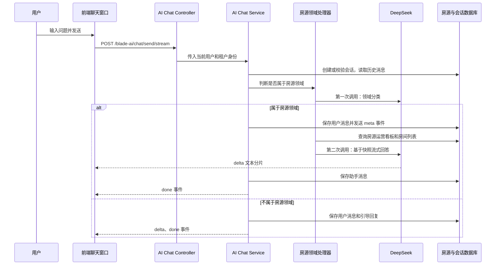

# 房源 AI 问答实施与 UI 复盘

## 1. 目标与边界

当前能力只覆盖园区房源问答，支持但不限于以下问题：

- 当前在租房源、房间、楼宇、楼层、面积、租金
- 房态、出租率、空置房间、在租和空置面积

客户、合同审批、财务、工单、系统操作、天气和闲聊等问题不在本期范围内。对于超出范围的问题，统一回复：

> 目前我只支持房源相关问答，例如“我现在租了哪些房源？”、“出租率是多少？”或“空置房间有多少？”。

设计原则是“先判定领域，再查询数据和回答”。不要把前端关键词判断作为唯一边界，也不要把无关问题直接送到数据查询和回答模型。

## 2. 已实现模块

| 层级 | 实现位置 | 职责 |
| --- | --- | --- |
| 全局挂载 | `saber3/src/page/index/index.vue` | 在后台主框架中挂载 AI 问答组件 |
| 对话 UI | `saber3/src/components/ai-chat-assistant/main.vue` | 会话列表、消息、窗口控制、删除确认、流式渲染 |
| 悬浮气泡 | `saber3/src/components/ai-chat-assistant/bubble.vue` | 独立气泡、拖动、位置持久化、打开窗口 |
| 前端 API | `saber3/src/api/ai/chat.js` | 历史会话接口和 `fetch` SSE 读取 |
| 后端接口 | `Boot/.../modules/ai/controller/AiChatController.java` | 会话、消息、删除、普通发送和流式发送接口 |
| 会话服务 | `Boot/.../modules/ai/service/impl/AiChatServiceImpl.java` | 鉴权隔离、持久化、路由领域处理器、SSE 事件编排 |
| 房源领域 | `Boot/.../modules/ai/service/impl/AiPropertyDomainHandler.java` | AI 领域判断、实时房源快照、房源回答和降级文案 |
| 模型客户端 | `Boot/.../modules/ai/service/DeepSeekChatClient.java` | DeepSeek OpenAI-compatible 请求、分类和流式解析 |
| 数据表 | `Boot/doc/sql/business/46_add_ai_chat_module.mysql.sql` | `biz_ai_conversation`、`biz_ai_message` |

## 3. 一次提问的完整流程



### 3.1 模型调用次数

| 场景 | DeepSeek 调用次数 | 说明 |
| --- | ---: | --- |
| 房源相关问题 | 通常 2 次 | 第一次分类；第二次结合实时房源数据流式回答 |
| 非房源问题 | 1 次 | 只做分类，随后由后端返回固定引导文案 |
| 分类接口不可用或返回格式异常 | 0 或 1 次 | 分类结果由本地关键词和上下文规则兜底；若判定相关，仍会尝试调用模型回答 |
| 回答模型不可用或流式无内容 | 2 次或更少 | 使用后端确定性回答兜底，不向用户暴露模型错误 |

每次模型请求会携带最多 8 条已保存的历史消息。历史只用于理解“哪些”“明细”等省略表达，不能扩大可问领域。

### 3.2 领域分类提示词

分类调用要求模型只返回 JSON，核心提示词如下：

```text
你是园区运营平台的问答路由器。请判断用户最新问题是否属于房源领域。
房源领域包括：房源、房间、房态、楼宇、楼层、面积、租金、出租率、空置、在租、租赁和租控数据。
与客户、合同审批、财务、工单、系统操作、天气、闲聊等无关的问题不属于房源领域。
结合历史对话判断省略表达，但不要因为历史对话而扩大领域范围。
只输出 JSON，不要 Markdown，不要额外解释，格式：{"inScope":true,"reason":"简短原因"}
```

如果分类响应无法解析，后端才会使用本地关键词和历史上下文规则作为降级方案。

### 3.3 房源回答提示词

在确认问题属于房源领域后，后端先查询最新数据，将下方提示词和实时快照一起传给模型：

```text
你是园区运营平台的房源助手，只能回答房源、房态、出租率、空置、在租房源、面积和租金相关问题。
必须只依据下方实时数据回答，不得编造数据或租客信息；回答使用简洁中文，需要时列点。
用户问题超出上述范围时，明确引导其询问房源问题。
实时房源数据：{实时 JSON 快照}
```

实时快照包含统计口径、总房源数、在租和空置指标，以及当前在租房源的园区、楼宇、房源、楼层、面积和月租金。

## 4. 数据、鉴权和流式协议

### 4.1 会话隔离

`biz_ai_conversation` 和 `biz_ai_message` 均保存 `tenant_id`、`user_id`。查询会话、读取消息、继续会话和删除会话均以 `tenant_id + user_id + conversation_id` 校验，防止用户跨租户或跨用户读取、删除历史记录。

删除会话时在事务内先删除消息，再删除会话本身。

### 4.2 SSE 事件

流式接口为 `POST /blade-ai/chat/send/stream`。前端不用 axios，而是用 `fetch` 读取 `ReadableStream`，因为常规 axios 请求会等到完整响应结束。

| 事件 | 内容 | 前端处理 |
| --- | --- | --- |
| `meta` | `conversationId`、已保存的用户消息 | 更新当前会话并替换临时用户消息 |
| `delta` | 文本片段 | 追加到当前助手消息，实现逐字输出 |
| `done` | 已保存的助手消息 | 用后端最终消息替换临时流式消息 |
| `error` | 错误文案 | 结束发送状态并提示用户 |

### 4.3 数据权限待确认项

当前房源快照通过 `IRentControlService.getBoard(...)` 和 `IRoomService.selectRoomList(...)` 获取。AI 会话历史已经按用户和租户隔离，但“我的房源”最终能看到哪些房源，仍依赖这两个业务服务自身的数据权限实现。

上线前必须确认这两个查询是否已按当前租户、园区权限和用户数据权限过滤。若没有，需在房源快照查询处显式传入或追加数据权限条件；不能仅依赖 AI 会话表的用户隔离。

## 5. 配置与扩展

DeepSeek 配置在 `Boot/src/main/resources/application.yml` 的 `ai.deepseek` 节点，其中 `api-key` 为固定配置位。替换该字段的值即可，密钥不要写入本文档、日志、前端代码或 SQL 脚本。

后续扩展客户 AI 问答时，不要在房源处理器中继续堆叠判断。新增一个实现 `AiDomainHandler` 的客户领域处理器，并分别提供：

1. `domain()`：例如 `customer`。
2. `supports()`：客户领域的 AI 分类和本地降级规则。
3. `answer()` / `streamAnswer()`：客户实时数据查询、提示词和降级回答。
4. 数据权限：明确客户数据的租户、园区和用户可见范围。

会话表中已有 `domain` 字段，通用的会话、消息、隔离、删除和流式传输能力可直接复用。

## 6. UI 实现步骤

1. 在后台主框架 `index.vue` 挂载唯一的 AI 对话组件，避免每个业务页面各自创建入口和会话状态。
2. 将悬浮入口从对话主组件中拆为 `bubble.vue`，主组件只管理会话和窗口状态。
3. 气泡使用 Pointer Events 实现鼠标和触摸拖动；拖动与点击分离，拖动结束后不触发打开对话。
4. 使用 `localStorage` 保存气泡坐标，页面重开后恢复位置，并在窗口缩放时限制在可视范围内。
5. 对话窗口提供关闭、最小化、放大/还原、新建会话、历史切换和删除能力。
6. 发送时立即插入临时用户消息，再按 `meta`、`delta`、`done` 事件更新，避免等待完整答案才显示。
7. 删除确认框放在 AI 对话窗口内部，覆盖当前窗口，而不是依赖一个与业务页面竞争层级的全局弹窗。

## 7. UI 踩坑与处理结论

| 问题 | 原因 | 处理方式 |
| --- | --- | --- |
| 对话窗口被顶部菜单和业务表格覆盖 | 气泡设置了层级，但打开后的面板没有设置 `z-index`，仍处于页面默认层 | 面板使用 `position: fixed; z-index: 3000; isolation: isolate` |
| 删除确认框被遮挡或不在对话窗口之上 | 全局 Element Plus MessageBox 通过 Teleport 挂到 `body`，和页面及窗口层级竞争；仅提高确认框层级无法突破父级低层级 | 使用对话窗口内部的遮罩和确认框；遮罩层级为 `3010`，面板本身先提升到 `3000` |
| 只提升删除弹层的 `z-index` 仍无效 | 子元素无法超过父级所在的 stacking context | 先提升父级对话面板层级，再管理内部删除层级；`isolation: isolate` 保证内部层级可预测 |
| 删除图标贴边、和标题不整齐 | 历史项 `width: 100%` 加内边距时未使用边框盒模型，删除按钮尺寸和占位不稳定 | 历史项设置 `box-sizing: border-box` 与最小高度；删除按钮固定 `28px` 尺寸、`margin-left: auto` 和固定 flex 基础宽度 |
| 鼠标拖动气泡时误打开对话 | `click` 会在 Pointer 结束后继续触发 | 使用移动阈值区分点击和拖动；拖动结束的后续点击被阻止 |
| 气泡拖出屏幕后无法找回 | 仅按移动位移更新坐标，没有边界限制 | 根据气泡尺寸和 viewport 计算边界，拖动和 `resize` 时都收敛坐标 |
| SSE 消息没有实时显示 | 使用普通请求封装时通常要等待整个响应体 | 改用 `fetch`、`ReadableStream` 和 SSE 事件分帧解析 |

## 8. 验证清单

- 使用两个不同用户或租户分别创建会话，确认无法读取、续聊或删除对方会话。
- 分别测试在租房源、出租率、空置房间、无关问题及“哪些”“明细”等追问。
- 断开或填写错误模型密钥，确认房源问题返回确定性兜底回答，无关问题仍返回范围引导。
- 测试删除确认框是否覆盖整个 AI 窗口，但不会覆盖窗口外的后台页面。
- 测试气泡在桌面和移动端的点击、拖动、边界限制、刷新后位置恢复。
- 测试窗口关闭、最小化、放大/还原及会话切换后消息滚动到底部。
- 前端修改后至少执行 Vue SFC 解析与 `git diff --check`；涉及业务主列表表格时执行 `pnpm check:business-table-ui`。
