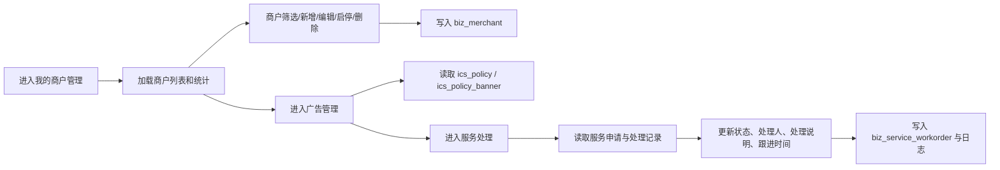

# BladeX 企业服务-我的商户管理迁移清单

本文用于迁移 RuoYi 中“企业服务”下的商户管理能力到 BladeX。目标菜单建议收口为“企业服务 -> 我的商户管理”，源端实际由“商户管理”主档案页、广告管理扩展页、服务处理页共同支撑。

## 1. 迁移边界

- 一级菜单：`企业服务`。
- 本次二级菜单：`我的商户管理`。
- 主流程：商户档案、服务区域、资质附件、状态管理、广告关联、服务处理查看。
- 前置依赖：园区、客户、附件上传、广告/服务处理页要能正常访问。
- 不纳入本次：物业服务、政策服务、在园企业数据。

## 2. 现状清单

### 2.1 菜单与路由

| 层级 | 菜单 | 现状组件 | 现状路径 | 权限 |
| --- | --- | --- | --- | --- |
| 一级 | 企业服务 | `PageView` | `/business/service` | 无 |
| 二级 | 商户管理 | `PageView` | `/business/service/merchant` | 无 |
| 三级 | 商户管理 | `business/MerchantList` | `/business/service/merchant/list` | `business:merchant:list` |
| 三级 | 广告管理 | `business/PolicyList` | `/business/service/merchant/ad` | `business:policy:list` |
| 三级 | 服务处理 | `business/ServiceProcessEmpty` | `/business/service/merchant/service-process` | `business:merchant:list` |

BladeX 目标建议：

```text
企业服务
  -> 我的商户管理
```

页面内部建议分三块：

- 商户档案
- 广告管理
- 服务处理

### 2.2 前端文件

- `ruoyi-ui/src/views/business/MerchantList.vue`
- `ruoyi-ui/src/views/business/PolicyList.vue`
- `ruoyi-ui/src/views/business/ServiceProcessEmpty.vue`
- `ruoyi-ui/src/views/business/MerchantManageEmpty.vue`
- `ruoyi-ui/src/api/business/merchant.js`
- `ruoyi-ui/src/api/business/policy.js`
- `ruoyi-ui/src/api/business/policyBanner.js`
- `ruoyi-ui/src/api/business/park.js`

### 2.3 后端文件

- `ruoyi-business/src/main/java/com/ruoyi/business/controller/MerchantController.java`
- `ruoyi-business/src/main/java/com/ruoyi/business/service/IMerchantService.java`
- `ruoyi-business/src/main/java/com/ruoyi/business/service/impl/MerchantServiceImpl.java`
- `ruoyi-business/src/main/java/com/ruoyi/business/mapper/MerchantMapper.java`
- `ruoyi-business/src/main/resources/mapper/business/MerchantMapper.xml`
- `ruoyi-business/src/main/java/com/ruoyi/business/domain/Merchant.java`

### 2.4 数据表

| 表名 | 作用 |
| --- | --- |
| `biz_merchant` | 商户档案主表 |
| `ics_policy` | 广告/政策内容表，商户扩展关联 |
| `ics_policy_banner` | 广告 Banner / 素材表 |

### 2.5 辅助字段

- `biz_merchant.qualification_files`
- `biz_service_workorder.processor`
- `biz_service_workorder.process_remark`
- `biz_service_workorder.next_follow_time`

## 3. 功能模块清单

### 3.1 商户档案

- [ ] 展示当前园区商户列表。
- [ ] 支持服务商名称、服务类型、服务区域、状态筛选。
- [ ] 展示服务商名称、服务类型、服务范围、联系人、联系方式、服务区域、状态、创建时间。
- [ ] 商户档案支持新增。
- [ ] 商户档案支持编辑。
- [ ] 商户档案支持启用 / 停用。
- [ ] 商户档案支持删除。

### 3.2 服务区域

- [ ] 支持按园区选择服务区域。
- [ ] 服务区域可多选。
- [ ] 服务区域保存为可回显的字符串。
- [ ] 服务区域查询与回显格式一致。

### 3.3 资质附件

- [ ] 支持上传资质文件。
- [ ] 支持附件回显。
- [ ] 支持附件删除。
- [ ] 附件保存为 JSON 列表。
- [ ] 附件上传走统一文件上传链路。

### 3.4 广告管理

- [ ] 商户可关联广告内容。
- [ ] 商户广告可展示广告名称、图片、收费标准。
- [ ] 广告详情页可查看服务商与图片素材。
- [ ] 广告状态可跟商户管理联动。

### 3.5 服务处理

- [ ] 服务处理页可按服务名称、申请企业、状态、申请时间查询。
- [ ] 服务处理页可查看申请详情。
- [ ] 服务处理页可变更处理状态。
- [ ] 服务处理页可填写处理人、处理说明、下次跟进时间。
- [ ] 服务处理记录需写入日志。

## 4. API 清单

### 4.1 商户档案

```text
GET    /business/merchant/summary
GET    /business/merchant/list
GET    /business/merchant/get/{merchantId}
POST   /business/merchant/save
POST   /business/merchant/update
POST   /business/merchant/remove
POST   /business/merchant/changeStatus
```

### 4.2 目标 BladeX 建议

```text
GET    /blade-ics/merchant/page
GET    /blade-ics/merchant/detail
POST   /blade-ics/merchant/save
POST   /blade-ics/merchant/update
POST   /blade-ics/merchant/remove
POST   /blade-ics/merchant/change-status
GET    /blade-ics/merchant/summary
```

### 4.3 广告与服务处理建议

```text
GET    /blade-ics/merchant/ad/page
GET    /blade-ics/merchant/ad/detail
GET    /blade-ics/merchant/service-process/page
POST   /blade-ics/merchant/service-process/update
GET    /blade-ics/merchant/service-process/log-list
```

## 5. 数据流走向



### 5.1 商户档案数据流

- 页面加载当前园区商户列表。
- 后端非管理员只看当前园区。
- 选择服务区域后保存为逗号字符串。
- 资质附件先上传，再把 URL 列表转成 JSON 保存。
- 状态变更后刷新列表和统计。

### 5.2 广告数据流

- 商户档案可跳转到广告管理。
- 广告管理展示广告内容与素材。
- 广告展示依赖 `ics_policy` 和 `ics_policy_banner`。
- 广告详情中可回看商户和收费标准。

### 5.3 服务处理数据流

- 服务处理页读取工单列表。
- 用户可按状态、企业、时间筛选。
- 打开详情后展示工单日志。
- 处理时更新状态、处理人、说明、下次跟进时间。
- 完成或关闭后不再进入处理态。

## 6. 关联模块

| 模块 | 关联方式 | 迁移要求 |
| --- | --- | --- |
| 园区档案 | 商户按园区隔离 | 园区列表必须可用 |
| 客户管理 | 服务对象和申请企业来源 | 企业名称、联系人要可追溯 |
| 文件上传 | 资质附件上传 | 上传地址和回显地址要打通 |
| 广告管理 | 商户延展内容 | `ics_policy`、`ics_policy_banner` 要可访问 |
| 服务处理 | 商户服务申请处理 | 工单状态流转要完整 |
| 企业服务菜单 | 一级/二级目录入口 | 菜单和权限要统一 |

## 7. 迁移顺序

### 7.1 第一阶段：商户档案

- [ ] 建立“企业服务”一级菜单。
- [ ] 建立“我的商户管理”二级菜单。
- [ ] 迁移商户列表。
- [ ] 迁移商户查询、详情、增改删、启停。

### 7.2 第二阶段：服务区域与附件

- [ ] 迁移服务区域多选。
- [ ] 迁移资质附件上传与回显。
- [ ] 迁移 JSON 附件保存。

### 7.3 第三阶段：广告管理

- [ ] 迁移广告列表。
- [ ] 迁移广告详情。
- [ ] 迁移商户到广告的关联展示。

### 7.4 第四阶段：服务处理

- [ ] 迁移服务处理列表。
- [ ] 迁移处理详情。
- [ ] 迁移状态更新、处理人、说明、跟进时间。

## 8. 并行 Work Tree 切片

- WT-A：商户列表、查询、菜单、权限。
- WT-B：商户表单、服务区域、附件上传。
- WT-C：广告管理、素材展示、详情联动。
- WT-D：服务处理、日志、状态流转。

## 9. 校验清单

### 9.1 菜单校验

- [ ] “企业服务”一级菜单可见。
- [ ] “我的商户管理”二级菜单可见。
- [ ] 角色授权后可访问。
- [ ] 未授权用户不可访问。

### 9.2 商户档案校验

- [ ] 只展示当前园区商户。
- [ ] 新建商户能落库。
- [ ] 编辑商户能更新。
- [ ] 启停状态正常切换。
- [ ] 删除后列表不可见。
- [ ] 服务区域回显正确。

### 9.3 附件校验

- [ ] 资质附件可上传。
- [ ] 资质附件可回显。
- [ ] 资质附件 JSON 存储正确。

### 9.4 广告校验

- [ ] 广告详情能联动到商户。
- [ ] 广告图片可展示。
- [ ] 广告收费标准可展示。

### 9.5 服务处理校验

- [ ] 列表查询正确。
- [ ] 详情正确。
- [ ] 状态更新正确。
- [ ] 处理人、处理说明、下次跟进时间正确落库。
- [ ] 日志可追溯。

## 10. 建议核对 SQL

```sql
-- 1. 商户是否存在无效园区
SELECT COUNT(*) AS invalid_count
FROM biz_merchant m
LEFT JOIN ics_park p ON p.id = m.park_id
WHERE m.del_flag = '0'
  AND m.park_id IS NOT NULL
  AND p.id IS NULL;

-- 2. 商户附件是否可解析
SELECT merchant_id, merchant_name, qualification_files
FROM biz_merchant
WHERE qualification_files IS NOT NULL AND qualification_files <> '';

-- 3. 商户服务区域是否为空
SELECT COUNT(*) AS invalid_count
FROM biz_merchant
WHERE del_flag = '0'
  AND (service_area IS NULL OR service_area = '');

-- 4. 广告是否存在无效商户关联
SELECT COUNT(*) AS invalid_count
FROM ics_policy p
LEFT JOIN biz_merchant m ON m.merchant_name = p.merchant_name
WHERE p.merchant_name IS NOT NULL
  AND m.merchant_id IS NULL;

-- 5. 服务处理是否存在无效园区
SELECT COUNT(*) AS invalid_count
FROM biz_service_workorder w
LEFT JOIN ics_park p ON p.id = w.park_id
WHERE w.del_flag = '0'
  AND w.park_id IS NOT NULL
  AND p.id IS NULL;
```

## 11. 交付标准

- [ ] 能从“企业服务 -> 我的商户管理”进入。
- [ ] 能看到商户列表和统计。
- [ ] 能完成商户新增、编辑、启停、删除。
- [ ] 能上传并回显资质附件。
- [ ] 能查看广告和服务处理关联页面。
- [ ] 能更新服务处理状态并落日志。
- [ ] 关联模块没有遗漏。
- [ ] 校验清单全部通过后，再迁移企业服务下一个二级菜单。

## 12. 风险点

- 源端“商户管理”与“广告管理 / 服务处理”是并列延展，目标菜单合并时要避免把它们写成互相嵌套的假关系。
- `service_area` 是字符串，多选与回显要统一分隔符。
- `qualification_files` 以 JSON 保存，迁移时要保证旧数据可回显。
- 广告管理引用的是 `ics_policy` 和 `ics_policy_banner`，不是纯商户表。
- 服务处理页本质是工单处理页，迁移时不要和商户档案混成一个表单。

