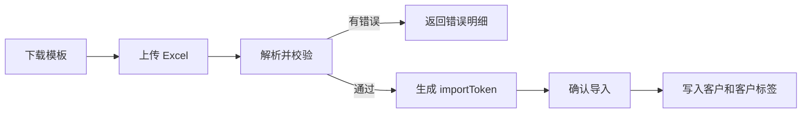
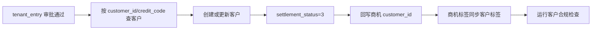
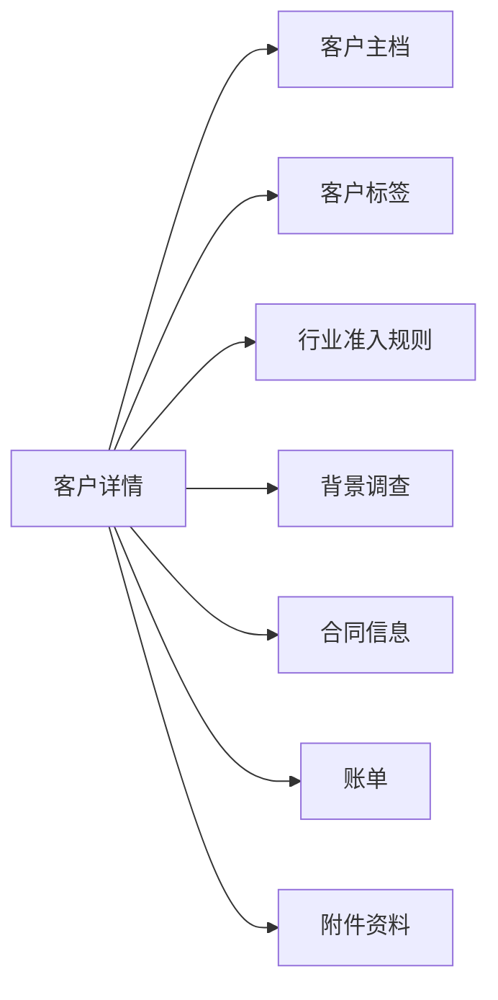

# BladeX 入驻管理 - 客户管理二级菜单迁移清单

本文档细化“入驻管理 > 客户管理”的迁移清单。客户管理是入驻链路的基础主数据，迁移前必须明确客户档案、客户标签、附件、导入导出、核验准入、合同账单、商机和项目审核之间的数据关系；迁移后必须按校验清单逐项核对，确保关联模块没有断链。

## 1. 菜单定位与迁移目标

### 1.1 菜单层级

| 层级 | 源菜单/页面 | 源项目信息 | BladeX 建议 |
| --- | --- | --- | --- |
| 一级菜单 | 入驻管理 | `menu_id=2229` | 保持为业务目录 |
| 二级菜单 | 客户管理 | `business/CustomerList` | 保留为入驻客户台账入口 |
| 关联菜单 | 客户标签 | `business/TagList` | 可作为独立二级菜单，也可作为客户管理的配置入口 |
| 编辑页 | 新增/编辑客户 | `CustomerEdit.vue`、`CustomerModal.vue` | BladeX 中作为隐藏路由或弹窗 |
| 详情页 | 客户详情抽屉 | `CustomerDetailDrawer.vue` | 保留详情页签，逐步接入合同、账单、附件 |

源项目中需要注意：

- `sql/biz_customer_menu.sql` 将“客户管理”和“客户标签”挂在“入驻管理”下。
- “客户管理”页面实际包含客户列表、统计卡片、导入、导出、背景调查、标签编辑、详情抽屉。
- “客户详情”中还展示行业准入、背景调查、合同信息、账单、附件资料。
- 迁移到 BladeX 时应保留“客户管理”为客户主数据入口，避免被合同管理或商机管理重复维护客户。

### 1.2 迁移目标

- 在 BladeX 中完成“入驻管理 > 客户管理”菜单、路由、按钮权限和接口权限。
- 迁移客户列表、统计、新增、编辑、详情、删除、状态变更。
- 迁移客户标签设置、客户附件上传、客户导入模板、导入校验、确认导入、导出。
- 迁移客户核验、行业准入、风险排查字段与本地规则。
- 保证客户被商机、项目审核、合同、账单等模块正确引用。
- 每个功能点完成后按本文档校验，不允许只验证页面能打开。

## 2. 源模块清单

### 2.1 后端源文件

| 类型 | 文件 | 说明 |
| --- | --- | --- |
| Controller | `ruoyi-business/src/main/java/com/ruoyi/business/controller/CustomerController.java` | 客户 CRUD、统计、导入、附件、核验 |
| Controller | `TagController.java` | 标签字典、客户标签查询 |
| Controller | `TagTypeController.java` | 标签类型 |
| Controller | `IndustryAccessRuleController.java` | 行业准入规则 |
| Service | `CustomerServiceImpl.java` | 客户保存、标签同步、删除校验、合规核验 |
| Service | `TagServiceImpl.java` | 标签校验、删除保护 |
| Service | `TagTypeServiceImpl.java` | 标签类型维护 |
| Service | `IndustryAccessRuleServiceImpl.java` | 行业准入规则维护 |
| Domain | `Customer.java` | 客户主实体 |
| Domain | `CustomerAttachment.java` | 客户附件 |
| Domain | `CustomerImportRow.java` | 导入行 |
| Domain | `CustomerImportResult.java` | 导入结果 |
| Domain | `CustomerLog.java` | 客户操作日志 |
| Domain | `Tag.java`、`TagType.java` | 标签与标签类型 |
| Mapper XML | `CustomerMapper.xml` | 客户查询、统计、写入、删除、核验结果 |
| Mapper XML | `CustomerAttachmentMapper.xml` | 客户附件 |
| Mapper XML | `TagMapper.xml`、`TagTypeMapper.xml` | 标签、客户标签关系 |

### 2.2 前端源文件

| 类型 | 文件 | 说明 |
| --- | --- | --- |
| API | `ruoyi-ui/src/api/business/customer.js` | 客户、标签、行业准入规则接口 |
| 列表页 | `ruoyi-ui/src/views/business/CustomerList.vue` | 客户列表、统计、导入导出、背景调查 |
| 编辑页 | `CustomerEdit.vue`、`modules/CustomerModal.vue` | 新增/编辑客户 |
| 详情页 | `modules/CustomerDetailDrawer.vue` | 客户详情、行业准入、合同、账单、附件 |
| 标签组件 | `modules/CustomerTagSelector.vue`、`modules/TagModal.vue` | 客户标签选择和编辑 |
| 标签页 | `TagList.vue` | 标签类型和标签管理 |
| 通用组件 | `TagSelect`、`TagCloud` | 标签选择和展示 |

### 2.3 SQL 源文件

| 文件 | 说明 |
| --- | --- |
| `sql/biz_customer.sql` | 客户、标签、行业准入、入驻需求、客户日志建表 |
| `sql/biz_customer_incremental.sql` | 客户核验和风险字段增量 |
| `sql/customer_modal_fields_incremental.sql` | 客户编辑页字段增量、信用代码索引调整 |
| `sql/customer_attachment_incremental.sql` | 客户附件表 |
| `sql/customer_park_optional_incremental.sql` | 客户园区字段兼容 |
| `sql/tag_type_management_incremental.sql` | 标签类型管理 |
| `sql/business_opportunity_tags_incremental.sql` | 商机标签关系，影响客户标签同步 |
| `sql/industry_access_rule_fix.sql` | 行业准入规则修正 |
| `sql/biz_customer_menu.sql` | 客户管理和客户标签菜单 |

## 3. 功能模块详细清单

### 3.1 客户列表与统计

源接口：

- `GET /business/customer/list`
- `GET /business/customer/statistics`

功能点：

- [ ] 客户分页列表。
- [ ] 统计卡片：客户总数量、合同总数量、本月新增客户数。
- [ ] 按企业名称查询。
- [ ] 按所属园区查询。
- [ ] 展示企业名称、联系人、联系电话、所属园区、背景调查入口、客户标签、创建时间。
- [ ] 点击企业名称进入客户详情。
- [ ] 支持编辑、查看、删除。
- [ ] 列表加载客户标签。
- [ ] 客户列表中缺少核验结果时会触发本地合规核验。

查询条件需要保留：

| 查询字段 | 说明 |
| --- | --- |
| `enterpriseName` | 企业名称模糊查询 |
| `creditCode` | 统一信用代码精确查询 |
| `industry` | 行业类型 |
| `scale` | 企业规模 |
| `cooperationLevel` | 合作等级 |
| `settlementStatus` | 入驻状态 |
| `status` | 客户状态 |
| `riskLevel` | 风险等级 |
| `contactName` | 联系人模糊查询 |
| `contactPhone` | 联系电话精确查询 |
| `parkId` | 所属园区或当前有效合同园区 |

BladeX 改造要点：

- 列表分页建议改为 `Query`、`Condition.getPage(query)`、`IPage`。
- 统计接口要确认是否按当前用户园区或数据权限过滤。
- 列表返回值建议包含 `tags`，避免前端逐行二次请求。
- 客户合规核验不建议在大列表循环里同步触发外部接口；第一阶段可保留本地规则，后续若接第三方征信需改为异步任务。

### 3.2 客户新增、编辑、详情

源接口：

- `GET /business/customer/get/{customerId}`
- `POST /business/customer/save`
- `POST /business/customer/update`

页面分区：

| 分区 | 关键字段 |
| --- | --- |
| 企业基本信息 | 企业名称、所属园区、统一信用代码、成立日期、注册资本、企业类型、行业类型、经营范围、注册地址、股权结构、组织架构、客户标签 |
| 经营状况信息 | 主营业务、上年度营收、主要合作客户、违法违规、失信记录、行业处罚 |
| 入驻需求信息 | 意向载体类型、意向面积、使用用途、租赁期限、装修要求、配套需求 |
| 联系人与招商信息 | 联系人、联系电话、邮箱、职务、招商渠道、第三方渠道、备注 |
| 详情页签 | 企业概览、工商信息、行业准入、背景调查、合同信息、账单、附件资料 |

核心业务规则：

- [ ] 企业名称必填，长度不超过 200。
- [ ] 联系人必填。
- [ ] 联系电话必填，新增/编辑接口只支持合法手机号。
- [ ] 所属园区必填。
- [ ] 新增时校验“企业名称 + 所属园区”不可重复。
- [ ] 信用代码允许为空；空字符串会转为 `null`。
- [ ] 地址为空时用注册地址补齐。
- [ ] 新增默认 `status='0'`。
- [ ] 新增默认 `settlementStatus=0`，导入客户默认 `settlementStatus=3`。
- [ ] 新增/编辑时同步客户标签。

客户状态：

| 字段 | 值 | 文案 |
| --- | --- | --- |
| `status` | `0` | 正常 |
| `status` | `1` | 停用 |
| `status` | `2` | 归档 |

入驻状态：

| 字段 | 值 | 文案 |
| --- | --- | --- |
| `settlement_status` | `0` | 未入驻 |
| `settlement_status` | `1` | 意向 |
| `settlement_status` | `2` | 签约 |
| `settlement_status` | `3` | 入驻 |

### 3.3 删除与状态变更

源接口：

- `POST /business/customer/remove`
- `POST /business/customer/changeStatus`

功能点：

- [ ] 支持批量删除客户。
- [ ] 删除客户前必须检查关联业务。
- [ ] 删除客户时同步删除客户标签关系。
- [ ] 支持启用、停用、归档。

删除保护依赖：

| 关联表 | 规则 |
| --- | --- |
| `biz_contract` | 有合同不允许删除 |
| `biz_contract_payment` | 有合同账单不允许删除 |
| `biz_customer_attachment` | 有附件不允许删除 |
| `biz_business_opportunity` | 有商机不允许删除 |
| `biz_business_opportunity_follow` | 有商机跟进不允许删除 |

迁移注意：

- BladeX 中如果使用逻辑删除 `is_deleted`，需要和源 `del_flag` 统一。
- 删除保护要放在事务内，避免标签删了但客户删除失败。
- 不建议物理删除客户主数据。

### 3.4 客户标签

源接口：

- `POST /business/customer/setTags/{customerId}`
- `GET /business/tag/list`
- `GET /business/tag/listByType/{tagType}`
- `GET /business/tag/listByCustomer/{customerId}`
- `POST /business/tag/save`
- `POST /business/tag/update`
- `POST /business/tag/remove`
- `GET /business/tagType/list`
- `POST /business/tagType/save`
- `POST /business/tagType/update`
- `POST /business/tagType/remove/{typeId}`

功能点：

- [ ] 客户列表展示客户标签。
- [ ] 客户编辑页选择客户标签。
- [ ] 客户详情按标签类型分组展示。
- [ ] 标签类型可维护。
- [ ] 标签字典可维护。
- [ ] 同一标签类型下标签名称不可重复。
- [ ] 标签删除默认校验客户标签和商机标签引用。
- [ ] `force=true` 时可强制删除标签。

数据规则：

- `biz_tag_type` 维护标签类型。
- `biz_tag` 维护标签字典，含 `tag_color`、`sort_order`、`park_id`。
- `biz_customer_tag` 维护客户与标签关系。
- 设置客户标签是覆盖式同步：先删客户原标签，再插入新标签。
- 商机审批通过后，会把商机标签覆盖同步为客户标签。

### 3.5 客户附件

源接口：

- `GET /business/customer/attachment/list/{customerId}`
- `POST /business/customer/attachment/upload`
- `POST /business/customer/attachment/remove/{attachmentId}`

功能点：

- [ ] 客户详情页展示附件资料。
- [ ] 支持多文件上传。
- [ ] 保存文件名、文件 URL、后缀、大小、上传人、上传时间。
- [ ] 支持查看和删除。

BladeX 改造要点：

- RuoYi 当前使用 `DfsConfig` 和 `FileUploadUtils`。
- BladeX 建议改为 `blade-resource`、OSS 或本地资源服务。
- 历史 `file_url` 先保持可访问；新上传文件走 BladeX 资源。
- 删除附件当前只删附件表记录，不删物理文件；迁移时要明确是否联动删除资源。

### 3.6 客户导入、模板、导出

源接口：

- `GET /business/customer/import/template`
- `POST /business/customer/import/validate`
- `POST /business/customer/import/confirm`
- `GET /business/customer/export`

导入模板字段：

| 字段 | 必填 | 说明 |
| --- | --- | --- |
| 企业名称 | 是 | `enterprise_name` |
| 统一信用代码 | 否 | `credit_code` |
| 企业规模 | 否 | `scale` |
| 联系人 | 是 | `contact_name` |
| 联系电话 | 是 | `contact_phone` |
| 联系邮箱 | 否 | `contact_email` |
| 合作等级 | 否 | 普通/VIP/战略 或 1/2/3 |
| 企业地址 | 否 | `address` |
| 迁入地 | 否 | `migration_place` |
| 迁入原因 | 否 | `migration_reason` |
| 所属园区 | 是 | 按园区名称匹配 |
| 客户标签 | 否 | 逗号、中文逗号、顿号分隔 |
| 备注 | 否 | `remark` |

导入校验规则：

- [ ] 禁止空文件、空白模板。
- [ ] 文件大小不超过 10M。
- [ ] 仅支持 `.xlsx`、`.xls`。
- [ ] 企业名称、联系人、联系电话、所属园区必填。
- [ ] 联系电话支持手机号或座机号。
- [ ] 所属园区必须能匹配系统园区名称。
- [ ] 模板内“企业名称 + 所属园区”不可重复。
- [ ] 数据库内“企业名称 + 所属园区”不可重复。
- [ ] 客户标签必须能匹配已启用标签。
- [ ] 字段不允许包含控制字符或特殊非法符号。
- [ ] 校验通过后返回 `importToken`，确认导入时才入库。

迁移注意：

- 源项目导入临时数据存在内存 `IMPORT_CACHE`，服务重启会失效；BladeX 可改为 Redis 临时缓存。
- 导出接口后端当前只是查询后返回成功，前端实际导出当前页 CSV；迁移时要决定是否实现后端 Excel 导出。
- 异常明细文件当前走 `/common/download`，迁移时应接 BladeX 下载接口或资源服务。

### 3.7 核验、行业准入与背景调查

源接口：

- `POST /business/customer/check/{customerId}`
- `GET /business/industryRule/list`
- `GET /business/industryRule/check`
- `POST /business/industryRule/save`
- `POST /business/industryRule/update`
- `POST /business/industryRule/remove`
- 背景调查复用商机接口：`getOpportunityBackgroundByName`

功能点：

- [ ] 客户详情展示基础信息核验状态。
- [ ] 客户详情展示行业准入结果和说明。
- [ ] 客户详情展示风险等级和风险摘要。
- [ ] 支持按行业准入规则判定限制/禁入。
- [ ] 支持背景调查结果展示：涉诉、被执行人、处罚、股东/高管关联风险。

本地核验规则：

- 企业名称非空且信用代码为 18 位时，基础信息核验通过，否则不通过。
- 行业为空时，行业准入按限制处理。
- 行业命中准入规则时，采用规则的 `access_type` 和 `reason`。
- 企业名称或备注含“失信、被执行、涉诉、处罚”等关键词时，风险等级为高。
- 当前背景调查是本地模拟结构，不是外部征信接口。

迁移注意：

- 第一阶段可保留本地规则，保证字段和页面可用。
- 后续接入外部征信接口时，建议异步化并记录查询快照。
- 行业准入规则如需按园区生效，必须明确 `park_id` 和数据权限。

## 4. 数据表与字段清单

### 4.1 客户核心表

| 表 | 说明 | 主关联 |
| --- | --- | --- |
| `biz_customer` | 客户主表 | `customer_id` |
| `biz_customer_attachment` | 客户附件 | `customer_id` |
| `biz_customer_tag` | 客户标签关系 | `customer_id + tag_id` |
| `biz_customer_log` | 客户操作日志 | `customer_id` |
| `biz_tag_type` | 标签类型 | `type_id` |
| `biz_tag` | 标签字典 | `tag_id` |
| `biz_industry_access_rule` | 行业准入规则 | `rule_id` |

### 4.2 关键字段

| 字段 | 表 | 说明 | 迁移注意 |
| --- | --- | --- | --- |
| `customer_id` | `biz_customer` | 客户 ID | 源库自增，BladeX 可保留业务主键名 |
| `enterprise_name` | `biz_customer` | 企业名称 | 必填 |
| `credit_code` | `biz_customer` | 统一信用代码 | 增量脚本已允许为空 |
| `park_id` | `biz_customer` | 所属园区 | 新增/导入必填，列表也会按有效合同园区匹配 |
| `contact_name` | `biz_customer` | 联系人 | 必填 |
| `contact_phone` | `biz_customer` | 联系电话 | 新增/编辑只支持手机号 |
| `cooperation_level` | `biz_customer` | 合作等级 | 1普通、2VIP、3战略 |
| `settlement_status` | `biz_customer` | 入驻状态 | 审批通过会更新为 3 |
| `status` | `biz_customer` | 客户状态 | 0正常、1停用、2归档 |
| `verify_status` | `biz_customer` | 基础核验状态 | 0未核验、1通过、2不通过 |
| `industry_access_result` | `biz_customer` | 行业准入结果 | 0未判定、1通过、2限制、3禁入 |
| `risk_level` | `biz_customer` | 风险等级 | 0未排查、1低、2中、3高 |
| `del_flag` | `biz_customer` | 逻辑删除 | BladeX 中需决定是否改 `is_deleted` |

### 4.3 关联业务表

| 表 | 关系 | 迁移影响 |
| --- | --- | --- |
| `biz_business_opportunity` | `customer_id` 指向客户 | 商机关联客户、审批通过回写客户 |
| `biz_business_opportunity_tag` | 商机标签 | 审批通过后同步客户标签 |
| `biz_business_opportunity_follow` | 商机跟进 | 删除客户前需要检查 |
| `biz_approval_project` | `customer_id` 指向客户 | 入驻项目审核通过会创建/更新客户 |
| `biz_contract` | `customer_id` 指向客户 | 客户详情展示合同，统计合同数量 |
| `biz_contract_payment` | 合同账单 | 客户详情展示账单，删除保护 |
| `ics_park` | `park_id` | 客户所属园区和导入园区名称匹配 |
| BladeX 用户/部门 | 创建人、更新人、数据权限 | 迁移时做账号和部门映射 |
| BladeX 资源/OSS | 客户附件 | 新上传附件走资源服务 |

## 5. 数据流走向

### 5.1 新增/编辑客户


关键规则：

- 新增先校验必填字段和“企业名称 + 所属园区”重复。
- 编辑时更新客户主表；如果传入标签，则覆盖客户标签。
- 信用代码为空时置为 `null`。
- 地址为空时用注册地址补齐。

### 5.2 客户导入



关键规则：

- 上传校验不直接入库。
- 只有确认导入时才写入 `biz_customer` 和 `biz_customer_tag`。
- 导入客户默认入驻状态为 `3`。

### 5.3 项目审核通过到客户



关键规则：

- 客户管理必须能接收项目审核模块写入或更新。
- 审批通过后客户入驻状态必须为 `3`。
- 商机标签同步客户标签是覆盖式同步。

### 5.4 客户详情反向关联



## 6. BladeX 迁移改造口径

### 6.1 后端改造口径

| RuoYi 写法 | BladeX 建议 |
| --- | --- |
| `BaseController` | `BladeController` 或业务 Controller 基类 |
| `com.ruoyi.common.core.domain.R` | `org.springblade.core.tool.api.R` |
| `startPage()`、`result(list)` | `Query`、`Condition.getPage(query)`、`IPage` |
| `IBaseServiceImpl` | `BaseServiceImpl` / `BladeServiceImpl` |
| `getLoginName()`、`getCurrentUserId()` | `AuthUtil.getUser()`、`BladeUser` |
| RuoYi `DfsConfig` 文件上传 | BladeX resource/OSS |
| `del_flag` | 统一决定保留或映射为 `is_deleted` |
| 内存 `IMPORT_CACHE` | Redis 缓存或导入临时表 |
| `javax.*` 校验注解 | SpringBoot3/BladeX 中使用 `jakarta.*` |

### 6.2 前端改造口径

| RuoYi/Vue2 页面 | BladeX/Saber3 建议 |
| --- | --- |
| `CustomerList.vue` | 迁移为客户管理主页面 |
| `CustomerModal.vue` / `CustomerEdit.vue` | 选择一种交互口径，避免弹窗和路由重复 |
| `CustomerDetailDrawer.vue` | 保留详情抽屉或改详情页，页签按功能逐步接入 |
| `CustomerTagSelector.vue` | 迁移为可复用标签选择组件 |
| Ant Design Vue 组件 | 按目标 BladeX 前端组件库改成 Element Plus/Avue/Saber3 规范 |
| 前端 CSV 导出 | 优先改为后端 Excel 导出，或明确保留当前页导出 |

### 6.3 菜单与权限口径

建议按钮权限：

| 权限标识 | 用途 |
| --- | --- |
| `business:customer:view` | 客户管理菜单 |
| `business:customer:list` | 客户列表 |
| `business:customer:add` | 新增客户 |
| `business:customer:edit` | 编辑客户 |
| `business:customer:remove` | 删除客户 |
| `business:customer:status` | 状态变更 |
| `business:customer:tag` | 设置客户标签 |
| `business:customer:attachment` | 附件上传/删除 |
| `business:customer:import` | 客户导入 |
| `business:customer:export` | 客户导出 |
| `business:customer:check` | 客户核验 |
| `business:tag:view` | 客户标签菜单 |
| `business:tag:add` | 新增标签 |
| `business:tag:edit` | 修改标签 |
| `business:tag:remove` | 删除标签 |
| `business:industryRule:view` | 行业准入规则 |

## 7. 迁移前准备清单

### 7.1 数据准备

- [ ] 确认 BladeX 库中是否已有客户相关表。
- [ ] 确认主键策略：保留源 ID、自增迁移，或改为 BladeX 雪花 ID。
- [ ] 确认 `biz_customer.credit_code` 是否允许为空。
- [ ] 确认 `park_id` 与目标园区数据已映射。
- [ ] 确认标签类型和标签字典先于客户标签关系迁移。
- [ ] 确认客户附件历史 URL 可访问。
- [ ] 确认合同、账单、商机、审批项目是否已经迁移或有占位映射。
- [ ] 确认 RuoYi 用户账号与 BladeX 用户账号的映射。

### 7.2 表结构准备

- [ ] `biz_customer` 字段完整，包含客户编辑页全部字段。
- [ ] `biz_customer_attachment` 已建立。
- [ ] `biz_customer_tag` 已建立唯一索引。
- [ ] `biz_tag_type`、`biz_tag` 已建立并有初始化数据。
- [ ] `biz_industry_access_rule` 已建立并有默认规则。
- [ ] 根据 BladeX 规范补齐 `tenant_id`、`create_user`、`create_dept`、`is_deleted` 等字段。
- [ ] 如果保留 `create_by/update_by/del_flag`，要在代码层明确兼容。

### 7.3 产品口径准备

- [ ] 确认客户是否必须绑定园区。
- [ ] 确认同一企业是否允许在不同园区重复建客户。
- [ ] 确认信用代码为空是否允许重复。
- [ ] 确认导入客户默认是否就是“已入驻”。
- [ ] 确认客户导出是导出当前页还是全量筛选结果。
- [ ] 确认客户标签是否按园区隔离。
- [ ] 确认背景调查是否暂保留模拟数据。

## 8. 数据校验 SQL

以下 SQL 按源表名编写。如果 BladeX 中改了表名或字段，需要同步调整。

### 8.1 核对基础数量

```sql
select 'customer' as table_name, count(*) as cnt from biz_customer where del_flag = '0'
union all
select 'customer_attachment', count(*) from biz_customer_attachment
union all
select 'customer_tag', count(*) from biz_customer_tag
union all
select 'tag_type', count(*) from biz_tag_type where del_flag = '0'
union all
select 'tag', count(*) from biz_tag where del_flag = '0'
union all
select 'industry_rule', count(*) from biz_industry_access_rule where del_flag = '0';
```

### 8.2 检查客户必填字段

```sql
select customer_id, enterprise_name, contact_name, contact_phone, park_id
from biz_customer
where del_flag = '0'
  and (
    enterprise_name is null or enterprise_name = ''
    or contact_name is null or contact_name = ''
    or contact_phone is null or contact_phone = ''
    or park_id is null
  );
```

### 8.3 检查企业名称 + 园区重复

```sql
select enterprise_name, park_id, count(*) as cnt
from biz_customer
where del_flag = '0'
group by enterprise_name, park_id
having count(*) > 1;
```

### 8.4 检查客户所属园区不存在

```sql
select c.customer_id, c.enterprise_name, c.park_id
from biz_customer c
left join ics_park p on p.id = c.park_id
where c.del_flag = '0'
  and c.park_id is not null
  and p.id is null;
```

### 8.5 检查客户标签孤儿数据

```sql
select ct.customer_id, ct.tag_id
from biz_customer_tag ct
left join biz_customer c on c.customer_id = ct.customer_id and c.del_flag = '0'
left join biz_tag t on t.tag_id = ct.tag_id and t.del_flag = '0'
where c.customer_id is null or t.tag_id is null;
```

### 8.6 检查客户附件孤儿数据

```sql
select a.attachment_id, a.customer_id, a.file_name, a.file_url
from biz_customer_attachment a
left join biz_customer c on c.customer_id = a.customer_id and c.del_flag = '0'
where c.customer_id is null;
```

### 8.7 检查合同、商机、审批项目客户引用

```sql
select 'contract' as source_table, ct.contract_id as source_id, ct.customer_id
from biz_contract ct
left join biz_customer c on c.customer_id = ct.customer_id and c.del_flag = '0'
where ct.del_flag = '0' and ct.customer_id is not null and c.customer_id is null
union all
select 'opportunity', o.opportunity_id, o.customer_id
from biz_business_opportunity o
left join biz_customer c on c.customer_id = o.customer_id and c.del_flag = '0'
where o.del_flag = '0' and o.customer_id is not null and c.customer_id is null
union all
select 'approval_project', p.project_id, p.customer_id
from biz_approval_project p
left join biz_customer c on c.customer_id = p.customer_id and c.del_flag = '0'
where p.process_status <> '9' and p.customer_id is not null and c.customer_id is null;
```

### 8.8 检查已入驻客户是否缺合同或审批来源

```sql
select c.customer_id, c.enterprise_name, c.settlement_status
from biz_customer c
where c.del_flag = '0'
  and c.settlement_status = 3
  and not exists (
    select 1 from biz_contract ct
    where ct.customer_id = c.customer_id and ct.del_flag = '0'
  )
  and not exists (
    select 1 from biz_approval_project p
    where p.customer_id = c.customer_id
      and p.business_type = 'tenant_entry'
      and p.process_status in ('2', '5')
  );
```

### 8.9 检查附件 URL 是否为空

```sql
select attachment_id, customer_id, file_name, file_url
from biz_customer_attachment
where file_url is null or file_url = '';
```

### 8.10 检查核验字段默认值

```sql
select customer_id, enterprise_name, verify_status, industry_access_result, risk_level
from biz_customer
where del_flag = '0'
  and (
    verify_status is null
    or industry_access_result is null
    or risk_level is null
  );
```

## 9. 分模块迁移任务清单

### 9.1 数据库与基础模型

- [ ] 迁移 `biz_customer`。
- [ ] 迁移 `biz_customer_attachment`。
- [ ] 迁移 `biz_customer_tag`。
- [ ] 迁移 `biz_customer_log`。
- [ ] 迁移 `biz_tag_type`。
- [ ] 迁移 `biz_tag`。
- [ ] 迁移 `biz_industry_access_rule`。
- [ ] 建立必要索引：`enterprise_name`、`credit_code`、`park_id`、`settlement_status`、`status`、`customer_id + tag_id`。
- [ ] 处理 `del_flag` 与 BladeX `is_deleted` 的映射。
- [ ] 处理 `create_by/update_by` 与 BladeX `create_user/update_user` 的映射。

### 9.2 后端客户接口

- [ ] 迁移客户列表接口。
- [ ] 迁移客户详情接口。
- [ ] 迁移客户统计接口。
- [ ] 迁移新增客户接口。
- [ ] 迁移编辑客户接口。
- [ ] 迁移删除客户接口。
- [ ] 迁移状态变更接口。
- [ ] 迁移客户标签设置接口。
- [ ] 迁移客户核验接口。
- [ ] 补齐事务边界。
- [ ] 补齐 `@PreAuth` 或菜单权限。
- [ ] 补齐数据权限和园区过滤。

### 9.3 后端标签与行业准入

- [ ] 迁移标签类型列表、新增、编辑、删除。
- [ ] 迁移标签列表、新增、编辑、删除。
- [ ] 迁移按类型查询标签。
- [ ] 迁移按客户查询标签。
- [ ] 迁移行业准入规则列表、新增、编辑、删除。
- [ ] 迁移行业准入检测接口。
- [ ] 校验标签删除保护。
- [ ] 校验标签强制删除口径。

### 9.4 后端附件与导入导出

- [ ] 迁移客户附件列表。
- [ ] 迁移客户附件上传。
- [ ] 迁移客户附件删除。
- [ ] 迁移导入模板生成。
- [ ] 迁移导入文件校验。
- [ ] 迁移确认导入。
- [ ] 迁移异常明细下载。
- [ ] 明确是否实现后端 Excel 导出。
- [ ] 导入临时缓存从内存改 Redis 或临时表。

### 9.5 前端页面

- [ ] 迁移客户管理菜单页面。
- [ ] 迁移客户列表和查询条件。
- [ ] 迁移统计卡片。
- [ ] 迁移新增/编辑客户页面或弹窗。
- [ ] 迁移客户详情抽屉。
- [ ] 迁移客户标签编辑。
- [ ] 迁移背景调查弹窗。
- [ ] 迁移导入客户弹窗。
- [ ] 迁移客户导出。
- [ ] 迁移客户附件页签。
- [ ] 迁移合同信息和账单页签的接口适配。
- [ ] 替换 RuoYi/Vue2 组件为 BladeX 当前前端组件。

### 9.6 菜单与权限

- [ ] 创建“入驻管理 > 客户管理”菜单。
- [ ] 绑定客户管理页面组件。
- [ ] 配置新增、编辑、删除、状态、标签、附件、导入、导出、核验按钮权限。
- [ ] 配置“客户标签”菜单或配置入口。
- [ ] 配置行业准入规则权限。
- [ ] 给管理员角色授权。
- [ ] 给招商、运营、财务等业务角色按需授权。

## 10. 迁移后校验清单

### 10.1 数据库校验

- [ ] 客户、附件、标签、行业规则数量与源库一致，或差异有说明。
- [ ] 客户必填字段无空值。
- [ ] “企业名称 + 园区”无重复。
- [ ] 客户 `park_id` 都能匹配园区。
- [ ] 客户标签无孤儿数据。
- [ ] 客户附件无孤儿数据。
- [ ] 合同、商机、审批项目引用的客户都存在。
- [ ] 已入驻客户来源可追溯到合同或入驻审批。
- [ ] 附件 URL 不为空且可访问。
- [ ] 核验字段默认值完整。

### 10.2 后端接口校验

- [ ] 未登录访问被拦截。
- [ ] 无权限账号不能访问客户管理接口。
- [ ] 普通账号只能看到自己权限范围内客户。
- [ ] 客户列表分页、查询、统计正常。
- [ ] 新增客户校验必填字段。
- [ ] 新增客户校验“企业名称 + 园区”重复。
- [ ] 编辑客户能更新客户标签。
- [ ] 删除客户存在关联业务时被拦截。
- [ ] 客户状态变更正常。
- [ ] 客户附件上传、删除正常。
- [ ] 客户导入校验、确认导入正常。
- [ ] 客户核验、行业准入规则正常。

### 10.3 前端页面校验

- [ ] 菜单能打开“客户管理”页面。
- [ ] 统计卡片数据显示正确。
- [ ] 查询条件有效。
- [ ] 客户标签展示正确。
- [ ] 新增客户保存成功。
- [ ] 编辑客户保存成功。
- [ ] 客户详情页签数据正确。
- [ ] 背景调查弹窗可打开并展示空/模拟数据。
- [ ] 行业准入结果展示正确。
- [ ] 合同信息、账单页签不报错。
- [ ] 附件可上传、查看、删除。
- [ ] 导入模板可下载。
- [ ] 导入异常可展示并下载异常明细。
- [ ] 导出行为符合产品口径。

### 10.4 端到端校验场景

必须至少跑通以下场景：

1. 新建标签类型和客户标签。
2. 新增客户，选择所属园区和客户标签。
3. 客户列表能查询到该客户，统计卡片刷新。
4. 打开客户详情，能看到基本信息、标签、核验状态。
5. 上传客户附件，并能查看和删除。
6. 执行客户核验，基础核验、行业准入、风险字段更新。
7. 从商机管理创建商机并关联该客户。
8. 商机提交项目审核，审批通过后客户入驻状态为 `3`。
9. 商机标签同步到客户标签。
10. 创建合同后，客户详情能展示合同和账单。
11. 尝试删除有关联业务的客户，系统必须拦截。

## 11. 风险与决策点

| 风险/决策 | 影响 | 建议 |
| --- | --- | --- |
| 客户是否强绑定园区 | 影响重复校验和数据权限 | 先按源规则保留 `park_id` 必填 |
| 信用代码是否唯一 | 空值和多园区客户会冲突 | 保留允许为空，非空可建立普通索引 |
| 导入缓存使用内存 | 服务重启导入 token 失效 | BladeX 中改 Redis 或临时表 |
| 列表触发核验 | 大数据量可能慢 | 第一阶段保留本地规则，外部征信改异步 |
| 标签强制删除 | 可能造成历史标签关系断裂 | 默认禁止，强制删除需单独权限 |
| 附件 URL 迁移 | 历史附件可能打不开 | 保留旧域名或批量迁移资源 |
| 客户详情依赖合同/账单 | 合同未迁移时页签报错 | 前端做空态，接口兼容 |
| `del_flag` 与 `is_deleted` 并存 | 查询漏数据或重复数据 | 每张表统一逻辑删除口径 |
| 客户由项目审核自动创建 | 字段来源不完整 | 审批通过后补齐客户字段并跑核验 |

## 12. 推荐迁移顺序

1. 先迁标签类型、标签字典和客户标签关系。
2. 再迁客户主表、客户附件、行业准入规则。
3. 再迁客户列表、详情、新增、编辑、删除、状态接口。
4. 再迁客户标签设置、附件上传、核验规则。
5. 再迁导入模板、导入校验、确认导入、导出。
6. 再迁前端客户列表、编辑、详情、导入、附件。
7. 最后与商机、项目审核、合同、账单做端到端联调。

建议把本菜单拆成 4 个工作包推进：

| 工作包 | 范围 | 完成标志 |
| --- | --- | --- |
| A. 标签底座 | 标签类型、标签字典、客户标签关系 | 标签选择器和标签展示可用 |
| B. 客户主档 | 客户 CRUD、列表、详情、状态、删除保护 | 客户主链路可用 |
| C. 附件与导入 | 附件、导入模板、导入校验、导出 | 文件和批量导入可用 |
| D. 核验与集成 | 行业准入、风险排查、商机/审批/合同联调 | 端到端场景跑通 |

