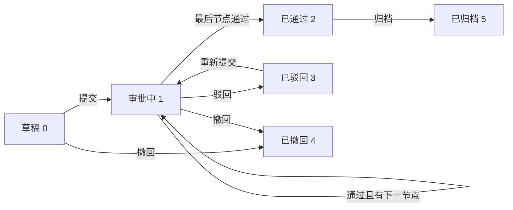

# BladeX 入驻管理 - 项目审核二级菜单迁移清单

本文档细化“入驻管理 > 项目审核”的迁移清单，重点覆盖入驻审批 `tenant_entry`。迁移前先按清单拆分模块、接口、数据表、数据流和依赖关系；迁移后必须按校验清单逐项核对，确保商机、客户、客户标签、审批资料、审批日志、流程配置等关联链路没有遗漏。

## 1. 菜单定位与迁移目标

### 1.1 菜单层级

| 层级 | 源菜单/页面 | 源项目信息 | BladeX 建议 |
| --- | --- | --- | --- |
| 一级菜单 | 入驻管理 | `menu_id=2229`，目录菜单 | 保持为业务目录 |
| 二级菜单 | 项目审核 | 源 SQL 中存在“项目审批/项目审核”命名差异 | 统一命名为“项目审核” |
| 页面组件 | `ApprovalProjectList.vue` | 入驻项目审核、审批中心、流程配置复用同一组件 | BladeX 中建议拆为项目审核页、审批中心页、流程配置页，或先保持复用再逐步拆分 |
| 业务类型 | `tenant_entry` | 入驻审批 | “入驻管理 > 项目审核”默认只看入驻审批 |

源项目中需要注意的菜单差异：

- `sql/approval_management.sql` 创建的是“项目审批”，组件为 `business/ApprovalProjectList`，路径为 `/settlementManage/approval`，且 `visible='1'`。
- `sql/fix_project_approval_route.sql`、`sql/business_service_submenus.sql` 中存在“项目审核”，组件同为 `business/ApprovalProjectList`，路径为 `/business/ApprovalProjectList`。
- `sql/menu_layout_consolidated.sql` 还创建了“审批中心”，包含我的审批、待办任务、已办任务、抄送我的、流程配置。
- 迁移到 BladeX 时应统一为：“入驻管理 > 项目审核”处理入驻审批项目；“审批中心”处理全局待办、已办、抄送和流程配置。避免同时出现可见的“项目审批”和“项目审核”两个入口。

### 1.2 迁移目标

- 在 BladeX 中完成“入驻管理 > 项目审核”菜单、路由、权限按钮和接口权限。
- 保留入驻审批项目列表、发起审核、查看详情、撤回、审批、驳回、转审、重新提交、归档能力。
- 保留审批资料上传、预览、下载、审批日志、审批表生成、导出和打印能力。
- 保留商机提交审核后进入项目审核的链路。
- 审批通过后必须同步客户、商机、客户标签、客户合规检查等关联数据。
- 每个子模块迁移完成后必须按本文档校验，不允许只验证页面能打开。

## 2. 源模块清单

### 2.1 后端源文件

| 类型 | 文件 | 说明 |
| --- | --- | --- |
| Controller | `ruoyi-business/src/main/java/com/ruoyi/business/controller/ApprovalController.java` | 项目、流程、材料、日志统一入口 |
| 项目服务 | `ApprovalProjectServiceImpl.java` | 审批状态机、业务回写、审批表导出 |
| 流程服务 | `ApprovalFlowServiceImpl.java` | 流程增删改查、节点保存、发布、复制 |
| 材料服务 | `ApprovalMaterialServiceImpl.java` | 审批资料保存和查询 |
| 日志服务 | `ApprovalLogServiceImpl.java` | 审批日志查询 |
| 实体 | `ApprovalProject.java` | 审批项目主实体 |
| 实体 | `ApprovalFlow.java` | 审批流程实体 |
| 实体 | `ApprovalNode.java` | 审批节点实体 |
| 实体 | `ApprovalMaterial.java` | 审批资料实体 |
| 实体 | `ApprovalLog.java` | 审批日志实体 |
| Mapper XML | `ApprovalProjectMapper.xml` | 项目列表、状态更新、软删除、超时查询 |
| Mapper XML | `ApprovalFlowMapper.xml` | 流程查询和写入 |
| Mapper XML | `ApprovalNodeMapper.xml` | 结构化节点查询和写入 |
| Mapper XML | `ApprovalMaterialMapper.xml` | 材料查询和写入 |
| Mapper XML | `ApprovalLogMapper.xml` | 日志查询和写入 |

### 2.2 前端源文件

| 类型 | 文件 | 说明 |
| --- | --- | --- |
| API | `ruoyi-ui/src/api/business/approval.js` | 审批项目、流程、材料、日志接口 |
| 页面 | `ruoyi-ui/src/views/business/ApprovalProjectList.vue` | 项目审核列表、审批操作、材料、审批表、流程配置复用页 |
| 页面 | `ruoyi-ui/src/views/business/ApprovalFlowConfig.vue` | 流程配置包装页 |
| 关联页面 | `BusinessOpportunityList.vue`、`BusinessOpportunityEdit.vue` | 商机提交审核入口 |
| 关联组件 | `BusinessPageHeading`、`BusinessSummaryCards`、`STable` | 页面标题、统计卡片、表格 |

### 2.3 SQL 源文件

| 文件 | 说明 |
| --- | --- |
| `sql/approval_management.sql` | 审批流程、节点、项目、材料、日志表及旧菜单 |
| `sql/approval_project_form_incremental.sql` | 审批表相关字段增量 |
| `sql/approval_workflow_closure_incremental.sql` | 审批流闭环增量 |
| `sql/approval_flow_config_menu.sql` | 流程配置菜单 |
| `sql/fix_project_approval_route.sql` | 项目审核路由修正 |
| `sql/menu_layout_consolidated.sql` | 审批中心菜单整合 |
| `sql/business_service_submenus.sql` | 入驻管理二级菜单 |

## 3. 功能模块详细清单

### 3.1 项目审核列表

源接口：

- `GET /business/approval/project/list`

功能点：

- [ ] 分页查询审批项目。
- [ ] 默认过滤 `businessType='tenant_entry'`。
- [ ] 在“入驻管理 > 项目审核”中默认排除草稿 `processStatus='0'`。
- [ ] 支持按项目名称、企业名称、审批状态查询。
- [ ] 展示项目名称、企业名称、来源商机 ID、当前节点、审批状态、资料数量、发起人、发起时间。
- [ ] 展示统计卡片：审批中、已通过、已驳回、已归档。
- [ ] 非管理员按园区过滤，管理员可跨园区查询。
- [ ] 待办场景按当前登录人匹配 `current_node`。

列表状态：

| 状态值 | 文案 | 说明 |
| --- | --- | --- |
| `0` | 草稿 | 已创建但未提交 |
| `1` | 审批中 | 当前节点处理中 |
| `2` | 已通过 | 流程结束且通过 |
| `3` | 已驳回 | 审批驳回 |
| `4` | 已撤回 | 发起人撤回 |
| `5` | 已归档 | 审批完成后归档 |
| `9` | 已删除 | 源 Mapper 用作软删除状态，不在页面展示 |

BladeX 改造要点：

- Controller 建议使用 `BladeController` 风格，统一返回 `R`。
- 分页建议使用 `Query`、`Condition.getPage(query)`、`IPage`。
- 当前用户、租户、角色建议使用 `AuthUtil.getUser()`，不要继续依赖 RuoYi `BaseController#getLoginName`。
- 数据权限建议明确使用 `tenant_id`、`park_id`、`create_dept` 或 `@DataAuth` 的边界，不要只靠前端传参。

### 3.2 发起审核与编辑项目

源接口：

- `POST /business/approval/project/save`
- `POST /business/approval/project/update`
- `GET /business/approval/project/get/{projectId}`

功能点：

- [ ] 支持从“项目审核”页面手动发起入驻审核。
- [ ] 支持从“商机管理”提交审核自动创建审批项目。
- [ ] 手动发起时必须选择或自动带出客户。
- [ ] 自动发起时从商机补齐企业名称、信用代码、负责人、联系电话、租赁面积、审批事项等字段。
- [ ] 未传 `businessType` 时默认 `tenant_entry`。
- [ ] 新增项目默认 `processStatus='0'`。
- [ ] 发起人默认当前登录账号，发起时间默认当前时间。
- [ ] 非管理员项目园区取当前用户园区；管理员可指定园区。

关键字段：

| 字段 | 来源 | 迁移注意 |
| --- | --- | --- |
| `park_id` | 当前用户园区或业务来源 | BladeX 需决定继续保留 `park_id` 还是并入数据权限 |
| `customer_id` | 客户或商机补齐 | `tenant_entry` 审批提交前必须有关联客户或可按信用代码创建客户 |
| `flow_id` | 入驻审批流程 | 必须是已发布启用的 `tenant_entry` 流程 |
| `business_type` | 业务类型 | 入驻审核固定 `tenant_entry` |
| `business_id` | 来源商机 ID | 用于回写商机审核结果 |
| `project_name` | 商机企业名或手工录入 | 为空时自动生成“企业名 入驻审核” |
| `enterprise_name` | 商机/客户 | 审批表展示字段 |
| `credit_code` | 商机/客户 | 审批通过时匹配客户 |
| `current_node` | 当前审批人账号 | BladeX 用户账号必须能匹配 |
| `current_node_name` | 当前审批节点名 | 审批进度展示 |

### 3.3 提交、撤回、审批、驳回、转审、重提、归档

源接口：

| 动作 | 接口 | 业务规则 |
| --- | --- | --- |
| 提交 | `POST /project/submit/{projectId}` | 进入第一个审批节点，写入提交日志 |
| 撤回 | `POST /project/withdraw/{projectId}` | 草稿或审批中可撤回，入驻商机审核状态重置 |
| 通过 | `POST /project/approve/{projectId}` | 当前审批人或管理员可操作，进入下一节点或完成 |
| 驳回 | `POST /project/reject/{projectId}` | 当前审批人或管理员可操作，状态改为已驳回 |
| 转审 | `POST /project/transfer/{projectId}` | 当前节点审批人转给其他账号 |
| 重提 | `POST /project/resubmit/{projectId}` | 仅驳回状态可重新提交 |
| 归档 | `POST /project/archive/{projectId}` | 状态改为已归档并记录归档时间 |

状态流转：



审批人校验：

- 非管理员只能审批 `current_node` 等于当前登录账号的项目。
- 管理员允许绕过当前审批人限制。
- 转审后 `current_node` 会变为转审人账号。
- 迁移到 BladeX 后，`current_node`、`approver_login`、`operator_name` 必须统一使用 BladeX 用户账号，不能混用 RuoYi `loginName`、昵称、手机号。

### 3.4 审批资料管理

源接口：

- `GET /business/approval/material/list`
- `POST /business/approval/material/save`
- `POST /business/approval/material/remove`
- `POST /business/approval/material/upload`

功能点：

- [ ] 项目详情中查询审批资料。
- [ ] 支持上传企业资质、背景调查报告、入驻方案、租金报价等材料。
- [ ] 保存资料类型、文件名、文件地址、后缀、大小、上传人、上传时间。
- [ ] 支持预览和下载。
- [ ] 删除资料时校验项目园区权限。

BladeX 改造要点：

- RuoYi 当前使用 `DfsConfig`、`FileUploadUtils`。
- BladeX 建议接入 `blade-resource`、OSS 或本地资源服务。
- 历史 `file_url` 先保持可访问；新上传文件统一走 BladeX 资源接口。
- 若启用多租户 OSS，每条材料需确认 `tenant_id`、`park_id` 与资源归属一致。

### 3.5 审批日志

源接口：

- `GET /business/approval/log/list`

功能点：

- [ ] 展示提交、通过、驳回、转审、撤回、重新提交等动作。
- [ ] 展示节点名称、操作人、操作时间、审批意见、转审人。
- [ ] 审批动作必须先写日志，再更新项目状态。
- [ ] 日志用于已办、抄送、审批表和问题追溯。

动作枚举：

| 动作 | 说明 |
| --- | --- |
| `SUBMIT` | 提交审批 |
| `APPROVE` | 审批通过 |
| `REJECT` | 审批驳回 |
| `TRANSFER` | 转审 |
| `WITHDRAW` | 撤回 |
| `RESUBMIT` | 重新提交 |

### 3.6 审批表生成、导出、打印

源接口：

- `GET /business/approval/project/form/{projectId}`
- `GET /business/approval/project/form/export/{projectId}`
- `GET /business/approval/project/print/{projectId}`

功能点：

- [ ] 审批表展示项目、流程、节点、材料、日志。
- [ ] 审批通过后页面提示客户已完成入驻，并引导后续合同管理。
- [ ] 支持导出企业入驻审批表 PDF。
- [ ] 支持浏览器打印或另存为 PDF。
- [ ] 导出成功后回写 `approval_form_url`。

迁移注意：

- 源项目使用 PDFBox 生成 PDF，并依赖中文字体候选。
- BladeX 迁移时要确认运行环境字体，避免中文乱码。
- 导出文件建议统一走 BladeX 资源服务，避免散落在本地上传目录。
- 如果第一阶段暂不迁移 PDF 生成，可先保留前端打印能力，但必须在清单中标记为临时方案。

### 3.7 流程配置依赖

源接口：

- `GET /business/approval/flow/list`
- `GET /business/approval/flow/get/{flowId}`
- `POST /business/approval/flow/save`
- `POST /business/approval/flow/update`
- `POST /business/approval/flow/remove`
- `GET /business/approval/flow/nodes/{flowId}`
- `POST /business/approval/flow/nodes/{flowId}`
- `POST /business/approval/flow/publish/{flowId}`
- `POST /business/approval/flow/copy/{flowId}`

功能点：

- [ ] 项目审核依赖至少一条已发布启用的 `tenant_entry` 流程。
- [ ] 流程支持园区级流程和全局流程。
- [ ] 选择默认流程时优先当前园区流程，再取全局流程。
- [ ] 发布流程时至少有一个审批节点。
- [ ] 审批节点必须配置审批人账号。
- [ ] 结构化节点表 `biz_approval_node` 是主方案，`biz_approval_flow.node_config` 作为兼容字段。

节点字段：

| 字段 | 说明 |
| --- | --- |
| `node_name` | 节点名称 |
| `node_order` | 节点顺序 |
| `node_type` | `submit`、`approve`、`cc` |
| `approver_login` | 审批人账号，多个逗号分隔 |
| `approver_name` | 审批人显示名 |
| `complete_condition` | `all`、`any` |
| `time_limit` | 节点时限，小时 |
| `cc_users` | 抄送人账号，多个逗号分隔 |

## 4. 数据表与字段清单

### 4.1 审批核心表

| 表 | 说明 | 主关联 |
| --- | --- | --- |
| `biz_approval_project` | 审批项目主表 | `project_id` |
| `biz_approval_flow` | 审批流程配置表 | `flow_id` |
| `biz_approval_node` | 审批节点结构化配置表 | `flow_id` |
| `biz_approval_material` | 审批资料表 | `project_id` |
| `biz_approval_log` | 审批操作日志表 | `project_id` |

### 4.2 关联业务表

| 表 | 关系 | 迁移影响 |
| --- | --- | --- |
| `biz_business_opportunity` | `tenant_entry` 项目的 `business_id` 指向商机 | 商机提交审核、撤回、通过后回写 |
| `biz_customer` | 项目关联客户 | 审批通过时创建或更新入驻客户 |
| `biz_business_opportunity_tag` | 商机标签 | 审批通过后同步到客户标签 |
| `biz_customer_tag` | 客户标签 | 入驻通过后被商机标签覆盖同步 |
| `biz_tag` | 标签字典 | 商机和客户共用 |
| `biz_contract` | 合同审批关联 | 共享审批模块，避免改坏 |
| `biz_contract_log` | 合同审批日志 | 合同审批通过时写日志 |
| `biz_termination` | 退租审批关联 | 共享审批模块，避免改坏 |
| 园区/楼栋/楼层/房间表 | 房源位置展示 | 项目租赁楼层、面积、后续合同依赖 |
| BladeX 用户/部门表 | 审批人、发起人、权限 | 账号映射必须提前完成 |

### 4.3 业务类型

| `business_type` | 文案 | 本菜单处理方式 |
| --- | --- | --- |
| `tenant_entry` | 入驻审批 | 本菜单主范围 |
| `contract_renewal` | 合同续签/合同审批 | 共享审批模块，迁移时必须回归验证 |
| `termination` | 退租审批 | 共享审批模块，迁移时必须回归验证 |

## 5. 数据流走向

### 5.1 商机提交审核到项目审核


关键规则：

- 商机提交审核通过 `business_type='tenant_entry'`、`business_id=opportunity_id` 关联审批项目。
- 未传 `flowId` 时自动选择当前园区或全局已启用的 `tenant_entry` 流程。
- 如果业务已在审批中，禁止重复提交。
- 如果业务已通过，禁止再次提交。
- 如果业务已驳回，再次提交走重新提交逻辑。

### 5.2 审批通过后的入驻闭环


必须保留的副作用：

- 按 `customer_id` 或 `credit_code` 查找客户。
- 客户不存在时，根据审批项目和商机创建客户。
- 客户存在时，补齐企业名称、信用代码、行业、联系人、电话、邮箱、地址。
- 更新客户入驻状态为 `3`。
- 调用客户合规检查。
- 商机标签覆盖同步到客户标签。
- 更新审批项目 `customer_id`。

### 5.3 撤回后的商机回退


关键规则：

- 仅草稿、审批中项目允许撤回。
- 入驻审批撤回后调用商机审核重置逻辑。
- 商机状态回到 `INITIAL`。

### 5.4 审批资料和审批表数据流


## 6. 模块关联关系

| 关联模块 | 依赖点 | 项目审核迁移要求 |
| --- | --- | --- |
| 商机管理 | 提交审核、撤回回退、审批通过后回写客户 | 商机接口先能创建项目审核记录 |
| 客户管理 | 审批通过后创建/更新客户 | 客户主表、入驻状态、合规检查可用 |
| 客户标签 | 商机标签同步客户标签 | 标签字典和关系表先完成迁移 |
| 流程配置 | 入驻审批流程、节点、审批人 | 至少一条启用 `tenant_entry` 流程 |
| 用户/部门 | 发起人、审批人、管理员判断 | RuoYi 账号映射到 BladeX 用户账号 |
| 文件资源 | 审批资料、审批表 PDF | 旧 URL 可访问，新上传走 BladeX 资源 |
| 合同管理 | 共享审批服务 `contract_renewal` | 项目审核改造后必须回归合同审批 |
| 退租管理 | 共享审批服务 `termination` | 项目审核改造后必须回归退租审批 |
| 园区资产 | 园区过滤、租赁楼层、面积 | `park_id` 和房源字段口径统一 |

## 7. BladeX 迁移改造口径

### 7.1 后端改造口径

| RuoYi 写法 | BladeX 建议 |
| --- | --- |
| `BaseController` | `BladeController` 或业务 Controller 基类 |
| `com.ruoyi.common.core.domain.R` | `org.springblade.core.tool.api.R` |
| `startPage()`、`result(list)` | `Query`、`Condition.getPage(query)`、`IPage` |
| `getLoginName()`、`getCurrentUserId()` | `AuthUtil.getUser()`、`BladeUser` |
| `User.isAdmin()` | BladeX 角色/权限判断或 `@PreAuth` |
| RuoYi `DfsConfig` 文件上传 | BladeX resource/OSS |
| `del_flag` 或 `process_status=9` | 统一决定使用 `is_deleted` 还是保留业务状态软删 |
| 手写园区过滤 | `tenant_id`、`park_id`、`@DataAuth` 组合 |
| `javax.*` 注解 | SpringBoot3/BladeX 中使用 `jakarta.*` |

### 7.2 前端改造口径

| RuoYi/Vue2 页面 | BladeX/Saber3 建议 |
| --- | --- |
| `ApprovalProjectList.vue` 大组件复用多个模式 | 先迁一版可用，再按项目审核、审批中心、流程配置拆页 |
| Ant Design Vue 组件 | 按目标 BladeX 前端组件库改成 Element Plus/Avue/Saber3 规范 |
| `loginName` 用户字段 | 统一映射 BladeX 用户账号字段 |
| `/business/approval/**` | 按 BladeX 后端实际路由和前端代理统一 |
| 文件 URL 直链 | 资源服务返回的 URL 或下载接口 |

### 7.3 菜单与权限口径

建议按钮权限：

| 权限标识 | 用途 |
| --- | --- |
| `business:approval:project:list` | 项目列表 |
| `business:approval:project:add` | 发起审核 |
| `business:approval:project:edit` | 编辑项目 |
| `business:approval:project:remove` | 删除项目 |
| `business:approval:project:submit` | 提交审核 |
| `business:approval:project:withdraw` | 撤回审核 |
| `business:approval:project:approve` | 审批通过/驳回 |
| `business:approval:project:transfer` | 转审 |
| `business:approval:project:archive` | 归档 |
| `business:approval:material:upload` | 上传审批资料 |
| `business:approval:form:export` | 导出审批表 |
| `business:approval:flow:list` | 流程配置 |

迁移时必须确认：

- [ ] BladeX 菜单中只有一个可见的“项目审核”入口。
- [ ] “项目审核”默认带 `businessType=tenant_entry`。
- [ ] “审批中心”若保留，应走 `scope=mine/todo/done/cc`。
- [ ] 流程配置可以放在审批中心，也可以作为项目审核下的按钮，但权限必须独立。

## 8. 迁移前准备清单

### 8.1 数据准备

- [ ] 确认 BladeX 库中是否已存在审批 5 张表。
- [ ] 确认主键策略：保留源 ID、自增迁移，或改为 BladeX 雪花 ID。
- [ ] 确认是否给审批表增加 `tenant_id`、`create_user`、`create_dept`、`is_deleted` 等 BladeX 基础字段。
- [ ] 确认 `park_id` 与目标园区数据已映射完成。
- [ ] 确认商机、客户、标签数据已迁移或有明确顺序。
- [ ] 确认审批人账号在 BladeX 用户表中存在。
- [ ] 确认历史附件 URL 在 BladeX 前端可访问。

### 8.2 流程准备

- [ ] 至少准备一条已发布启用的 `tenant_entry` 流程。
- [ ] 流程节点顺序正确。
- [ ] 审批节点存在审批人账号。
- [ ] 默认流程不再依赖源项目中的 `xiaowang`、`xiaozhang` 测试账号，除非这些账号已同步到 BladeX。
- [ ] 园区级流程和全局流程的优先级明确。

### 8.3 代码准备

- [ ] 确定迁移目标模块目录，例如 BladeX Boot 工程中的业务模块。
- [ ] 确定是否先保持原表名 `biz_approval_*`，避免一次性改动过大。
- [ ] 确定是否把审批模块抽为公共业务服务，供入驻、合同、退租复用。
- [ ] 确定是否继续自研审批流，或后续再替换为 BladeX Flowable。第一阶段建议先迁自研审批流，保证业务闭环。

## 9. 数据校验 SQL

以下 SQL 用于迁移前后核对，表名按源项目保留。如果目标 BladeX 表名调整，需要同步改写。

### 9.1 核对基础数量

```sql
select 'flow' as table_name, count(*) as cnt from biz_approval_flow
union all
select 'node', count(*) from biz_approval_node
union all
select 'project', count(*) from biz_approval_project
union all
select 'material', count(*) from biz_approval_material
union all
select 'log', count(*) from biz_approval_log;
```

### 9.2 检查入驻项目是否缺流程

```sql
select p.project_id, p.project_name, p.flow_id, p.business_type, p.process_status
from biz_approval_project p
left join biz_approval_flow f on f.flow_id = p.flow_id
where p.business_type = 'tenant_entry'
  and p.process_status <> '9'
  and (p.flow_id is null or f.flow_id is null);
```

### 9.3 检查入驻项目是否缺来源商机

```sql
select p.project_id, p.project_name, p.business_id
from biz_approval_project p
left join biz_business_opportunity o on o.opportunity_id = p.business_id
where p.business_type = 'tenant_entry'
  and p.process_status <> '9'
  and (p.business_id is null or o.opportunity_id is null);
```

### 9.4 检查入驻项目是否缺客户

```sql
select p.project_id, p.project_name, p.customer_id, p.enterprise_name, p.credit_code
from biz_approval_project p
left join biz_customer c on c.customer_id = p.customer_id
where p.business_type = 'tenant_entry'
  and p.process_status <> '9'
  and (p.customer_id is null or c.customer_id is null);
```

### 9.5 检查材料和日志是否存在孤儿数据

```sql
select m.material_id, m.project_id, m.file_name
from biz_approval_material m
left join biz_approval_project p on p.project_id = m.project_id
where p.project_id is null;

select l.log_id, l.project_id, l.action_type, l.operator_name
from biz_approval_log l
left join biz_approval_project p on p.project_id = l.project_id
where p.project_id is null;
```

### 9.6 检查流程节点是否缺流程

```sql
select n.node_id, n.flow_id, n.node_name
from biz_approval_node n
left join biz_approval_flow f on f.flow_id = n.flow_id
where f.flow_id is null;
```

### 9.7 检查是否有可用入驻审批流程

```sql
select flow_id, park_id, flow_name, business_type, flow_version, status
from biz_approval_flow
where business_type = 'tenant_entry'
  and status = '1'
order by park_id desc, flow_version desc, flow_id desc;
```

### 9.8 检查审批中项目是否缺当前审批人

```sql
select project_id, project_name, current_node, current_node_name
from biz_approval_project
where process_status = '1'
  and (current_node is null or current_node = '');
```

### 9.9 检查审批人账号是否需要映射

以下 SQL 需要按 BladeX 用户表字段调整，重点是找出 `current_node`、`approver_login`、`operator_name` 在目标用户表中不存在的账号。

```sql
select distinct account
from (
  select current_node as account from biz_approval_project where current_node is not null and current_node <> ''
  union
  select approver_login as account from biz_approval_node where approver_login is not null and approver_login <> ''
  union
  select operator_name as account from biz_approval_log where operator_name is not null and operator_name <> ''
) t;
```

## 10. 分模块迁移任务清单

### 10.1 数据库与基础模型

- [ ] 建立或迁移 `biz_approval_flow`。
- [ ] 建立或迁移 `biz_approval_node`。
- [ ] 建立或迁移 `biz_approval_project`。
- [ ] 建立或迁移 `biz_approval_material`。
- [ ] 建立或迁移 `biz_approval_log`。
- [ ] 根据 BladeX 规范补齐 `tenant_id`、审计字段、逻辑删除字段。
- [ ] 建立必要索引：`flow_id`、`project_id`、`customer_id`、`business_type + business_id`、`process_status`、`park_id`。
- [ ] 准备账号映射脚本，把源审批人账号映射到 BladeX 用户账号。

### 10.2 后端项目审核接口

- [ ] 迁移项目详情接口。
- [ ] 迁移项目分页列表接口。
- [ ] 迁移新增项目接口。
- [ ] 迁移编辑项目接口。
- [ ] 迁移删除项目接口。
- [ ] 迁移提交接口。
- [ ] 迁移撤回接口。
- [ ] 迁移通过接口。
- [ ] 迁移驳回接口。
- [ ] 迁移转审接口。
- [ ] 迁移重新提交接口。
- [ ] 迁移归档接口。
- [ ] 迁移超时审批查询接口。
- [ ] 补齐 `@PreAuth` 或菜单权限。
- [ ] 补齐事务边界，审批通过后的客户、商机、标签同步必须在事务内。

### 10.3 后端流程配置接口

- [ ] 迁移流程列表、详情、新增、修改、删除。
- [ ] 迁移流程节点查询和保存。
- [ ] 迁移发布流程校验。
- [ ] 迁移复制流程。
- [ ] 发布时校验至少一个审批节点。
- [ ] 发布时校验审批人账号存在。
- [ ] 保留 `node_config` 兼容逻辑，优先使用 `biz_approval_node`。

### 10.4 后端材料与审批表

- [ ] 迁移材料列表。
- [ ] 迁移材料保存。
- [ ] 迁移材料删除。
- [ ] 迁移材料上传到 BladeX 资源服务。
- [ ] 迁移审批表数据聚合接口。
- [ ] 迁移审批表导出接口。
- [ ] 迁移打印接口。
- [ ] 验证中文 PDF 字体。
- [ ] 验证历史文件 URL 和新文件 URL 都可访问。

### 10.5 前端页面

- [ ] 在 BladeX 前端新增“入驻管理 > 项目审核”菜单页面。
- [ ] 迁移项目审核列表和查询条件。
- [ ] 迁移状态标签、统计卡片、操作列。
- [ ] 迁移发起审核弹窗。
- [ ] 迁移审批动作弹窗。
- [ ] 迁移材料抽屉或详情区域。
- [ ] 迁移审批表弹窗、导出、打印。
- [ ] 迁移流程配置页面或确认由审批中心承接。
- [ ] 替换 RuoYi/Vue2 组件为 BladeX 当前前端组件。
- [ ] 确保移动端或窄屏下表格、弹窗不遮挡关键按钮。

### 10.6 菜单与权限

- [ ] 创建“入驻管理 > 项目审核”菜单。
- [ ] 绑定项目审核页面组件。
- [ ] 配置列表、查看、新增、编辑、删除、提交、撤回、审批、转审、归档、材料上传、审批表导出按钮权限。
- [ ] 给管理员角色授权。
- [ ] 给业务角色授权。
- [ ] 删除或隐藏重复的“项目审批”旧菜单。
- [ ] 确认审批中心菜单与项目审核菜单不会互相覆盖路由。

## 11. 迁移后校验清单

### 11.1 数据库校验

- [ ] 审批 5 张核心表数量与源库一致，或差异有说明。
- [ ] `tenant_entry` 项目都能找到来源商机。
- [ ] `tenant_entry` 项目都能找到客户，或能按信用代码补建客户。
- [ ] 审批项目都能找到流程。
- [ ] 审批流程都至少有一个审批节点。
- [ ] 审批中项目都有当前审批人。
- [ ] 材料和日志没有孤儿数据。
- [ ] 已通过入驻审批的客户 `settlement_status=3`。
- [ ] 商机标签已同步到客户标签。

### 11.2 后端接口校验

- [ ] 未登录访问被拦截。
- [ ] 无权限账号无法访问项目审核接口。
- [ ] 普通账号只能看到自己园区或数据权限范围内的项目。
- [ ] 管理员可按权限查看全部或指定园区项目。
- [ ] 非当前审批人不能审批当前节点。
- [ ] 当前审批人可以通过、驳回、转审。
- [ ] 管理员审批绕过逻辑符合业务预期。
- [ ] 提交、撤回、通过、驳回、转审、重提、归档均写入日志。
- [ ] 审批通过后的客户、商机、标签同步成功。
- [ ] 任一同步失败时事务回滚，不出现项目已通过但客户未更新的半成功状态。

### 11.3 前端页面校验

- [ ] 菜单能打开“项目审核”页面。
- [ ] 默认只展示入驻审批项目。
- [ ] 项目名称、企业名称、状态查询有效。
- [ ] 状态标签显示正确。
- [ ] 资料数量显示正确。
- [ ] 发起审核弹窗可正常保存。
- [ ] 审批操作弹窗能显示当前节点和意见输入。
- [ ] 审批表弹窗能显示项目、流程、日志。
- [ ] 材料可上传、预览、下载。
- [ ] 导出审批表后可打开文件。
- [ ] 没有重复菜单、错误路由、空白页面。

### 11.4 端到端校验场景

必须至少跑通以下场景：

1. 在商机管理中新建一条入驻商机，并维护客户标签。
2. 从商机提交入驻审核。
3. 在“入驻管理 > 项目审核”列表看到该项目。
4. 上传一份审批资料。
5. 当前节点审批人登录后审批通过。
6. 如果有多个节点，继续用下一节点审批人审批通过。
7. 最后节点通过后，项目状态变为已通过。
8. 客户自动创建或更新，入驻状态为已入驻。
9. 商机回写 `customer_id`。
10. 商机标签同步为客户标签。
11. 审批日志完整记录提交和通过动作。
12. 审批表可查看、导出、打印。

还需要回归以下共享场景：

- [ ] 合同审批 `contract_renewal` 仍可通过并更新合同状态。
- [ ] 退租审批 `termination` 仍可通过或驳回并更新退租状态。
- [ ] 审批中心待办、已办、抄送查询不受项目审核过滤影响。

## 12. 风险与决策点

| 风险/决策 | 影响 | 建议 |
| --- | --- | --- |
| “项目审批”和“项目审核”重复菜单 | 用户入口混乱，权限重复 | 统一保留“项目审核” |
| 审批人账号不匹配 | 待办为空，审批无法操作 | 迁移前完成账号映射 |
| 默认流程依赖测试账号 | 提交后无人可审 | 上线前重配真实审批节点 |
| `tenant_id` 与 `park_id` 口径不清 | 数据隔离不准确 | 先定数据权限方案再迁表 |
| 旧附件 URL 不可访问 | 审批资料丢失 | 保留旧文件域名或批量迁到 BladeX 资源 |
| PDF 中文字体缺失 | 审批表乱码 | 在目标运行环境安装字体或改用稳定模板方案 |
| 共享审批模块被改坏 | 合同、退租流程异常 | 项目审核迁移后必须回归合同和退租 |
| 审批通过副作用未加事务 | 数据半成功 | 客户、商机、标签同步必须事务包裹 |
| 第一阶段直接替换 Flowable | 范围过大 | 先迁自研审批流，后续单独评估工作流升级 |

## 13. 推荐迁移顺序

1. 先迁数据库表和基础数据，完成流程、节点、项目、材料、日志的静态校验。
2. 再迁后端只读接口，先让项目审核列表、详情、日志、材料查询可用。
3. 再迁状态流转接口，提交、撤回、通过、驳回、转审、重提逐个验。
4. 再迁业务副作用，重点验证审批通过后客户、商机、标签同步。
5. 再迁文件上传和审批表导出。
6. 最后迁前端菜单、页面、按钮权限，并跑端到端场景。

建议把本菜单拆成 4 个独立工作包并行推进：

| 工作包 | 范围 | 完成标志 |
| --- | --- | --- |
| A. 数据与流程 | 表结构、数据迁移、默认流程、账号映射 | SQL 校验无阻断问题 |
| B. 项目审核后端 | 项目接口、状态机、业务回写 | 接口和事务校验通过 |
| C. 材料与审批表 | 文件资源、材料、日志、审批表 | 上传、预览、导出可用 |
| D. 前端与权限 | 菜单、页面、按钮、角色授权 | 端到端场景跑通 |

