# BladeX 审批中心-流程配置迁移清单

本文用于迁移 RuoYi 中“审批中心”下的二级菜单“流程配置”。该菜单是审批中心的流程底座，负责流程模板、节点配置、发布、复制与园区隔离。

## 1. 迁移边界

- 一级菜单保留为“审批中心”。
- 本次只迁移二级菜单“流程配置”。
- 页面主体以“流程列表 + 节点编辑 + 发布 + 复制 + 删除”为主。
- 不迁移业务审批页面本身，只保留流程配置对“我的审批 / 待办任务 / 已办任务 / 抄送我的”的支撑能力。

## 2. 现状清单

### 2.1 菜单与路由

| 项目 | 现状 |
| --- | --- |
| 一级菜单 | `审批中心` |
| 二级菜单 | `流程配置` |
| 路由 | `/assetManage/approval/flow-config` |
| 组件 | `business/ApprovalFlowConfig` |
| 实际承载 | `business/ApprovalProjectList mode="flowConfig"` |
| 权限 | `business:approval:flow:list` |

### 2.2 前端文件

- `ruoyi-ui/src/views/business/ApprovalFlowConfig.vue`
- `ruoyi-ui/src/views/business/ApprovalProjectList.vue`
- `ruoyi-ui/src/api/business/approval.js`

### 2.3 后端文件

- `ruoyi-business/src/main/java/com/ruoyi/business/controller/ApprovalController.java`
- `ruoyi-business/src/main/java/com/ruoyi/business/service/impl/ApprovalFlowServiceImpl.java`
- `ruoyi-business/src/main/java/com/ruoyi/business/service/impl/ApprovalProjectServiceImpl.java`
- `ruoyi-business/src/main/resources/mapper/business/ApprovalFlowMapper.xml`
- `ruoyi-business/src/main/resources/mapper/business/ApprovalNodeMapper.xml`
- `ruoyi-business/src/main/java/com/ruoyi/business/mapper/ApprovalFlowMapper.java`
- `ruoyi-business/src/main/java/com/ruoyi/business/mapper/ApprovalNodeMapper.java`
- `ruoyi-business/src/main/java/com/ruoyi/business/domain/ApprovalFlow.java`
- `ruoyi-business/src/main/java/com/ruoyi/business/domain/ApprovalNode.java`

### 2.4 数据表

| 表名 | 作用 |
| --- | --- |
| `biz_approval_flow` | 审批流程主表 |
| `biz_approval_node` | 审批节点表 |

## 3. 功能模块清单

### 3.1 流程列表

- [ ] 展示当前园区的流程列表。
- [ ] 支持按流程名称、业务类型、状态查询。
- [ ] 展示流程名称、业务类型、版本号、节点链路、状态、操作。
- [ ] 列表默认按园区优先、版本倒序展示。

### 3.2 新建流程

- [ ] 可新建审批流程草稿。
- [ ] 默认生成基础节点。
- [ ] 流程名称、业务类型必填。
- [ ] 新流程默认状态为草稿。
- [ ] 新流程默认版本号为 1。

### 3.3 节点编辑

- [ ] 支持编辑节点名称。
- [ ] 支持编辑节点类型。
- [ ] 支持选择审批人。
- [ ] 支持设置完成条件。
- [ ] 支持设置超时时间。
- [ ] 支持配置抄送人。
- [ ] 节点顺序必须可控。

### 3.4 保存流程

- [ ] 保存流程主表。
- [ ] 保存结构化节点表。
- [ ] 同步 `nodeConfig` JSON。
- [ ] 节点与流程必须同园区。

### 3.5 发布流程

- [ ] 发布前必须校验至少一个审批节点。
- [ ] 发布前必须校验节点名称不为空。
- [ ] 发布前必须校验审批节点已配置审批人。
- [ ] 发布后状态变为已发布。
- [ ] 发布后版本号自动递增。

### 3.6 复制流程

- [ ] 复制后生成草稿流程。
- [ ] 复制流程名称追加副本标识。
- [ ] 复制结构化节点。
- [ ] 复制后不能直接当已发布流程使用。

### 3.7 删除流程

- [ ] 删除动作必须只影响当前园区。
- [ ] 删除后流程状态置为失效。
- [ ] 删除时要一并考虑节点数据清理。

## 4. 数据流走向

```mermaid
flowchart LR
  A["进入流程配置菜单"] --> B["前端加载流程列表"]
  B --> C["ApprovalController.flowList"]
  C --> D["按当前园区过滤流程"]
  D --> E["ApprovalFlowMapper.selectApprovalFlowList"]
  E --> F["返回流程列表"]
  F --> G["前端展示流程链路"]
  G --> H["新建 / 编辑流程"]
  H --> I["保存流程主表"]
  I --> J["保存节点表"]
  J --> K["同步 nodeConfig JSON"]
  K --> L["发布 / 复制 / 删除"]
```



### 4.1 列表数据流

- 页面进入后加载流程列表。
- 非管理员只看当前园区。
- 管理员可在园区范围内查看。
- 流程列表按版本倒序、园区优先排序。

### 4.2 节点数据流

- 打开编辑弹窗时先取结构化节点。
- 若结构化节点为空，则回退解析 `nodeConfig`。
- 保存时同时写结构化节点表和 JSON 配置。
- 前端节点顺序即后端 `node_order`。

### 4.3 发布数据流

- 用户点击发布。
- 后端先校验节点完整性。
- 通过后状态改为已发布，版本号递增。
- 业务发起审批时再从已发布流程中取默认流程。

## 5. 关联模块

| 模块 | 关联方式 | 迁移要求 |
| --- | --- | --- |
| 我的审批 | 读取已发布流程并展示审批进度 | 流程配置不通会导致审批列表无法正常发起 |
| 待办任务 | 当前节点依赖流程节点配置 | 节点审批人必须能映射到系统用户 |
| 已办任务 | 依赖流程日志与节点链路 | 节点改动后日志要保持可追溯 |
| 抄送我的 | 依赖节点抄送人配置 | `cc_users` 要可解析 |
| 入驻审批 | 默认业务类型 `tenant_entry` | 发起流程必须先有可用流程 |
| 合同审批 | 业务类型 `contract_renewal` | 发布前要校验业务类型匹配 |
| 退租审批 | 业务类型 `termination` | 发布前要校验业务类型匹配 |
| 用户管理 | 审批人选择来源 | `loginName` 不能失真 |
| 园区管理 | 流程按园区隔离 | 非管理员不能跨园区编辑 |

## 6. BladeX 迁移顺序

### 6.1 第一阶段：流程骨架

- [ ] 建立“审批中心”一级菜单。
- [ ] 建立“流程配置”二级菜单。
- [ ] 迁移流程列表。
- [ ] 迁移新建 / 编辑弹窗。
- [ ] 迁移节点链路展示。

### 6.2 第二阶段：节点维护

- [ ] 迁移结构化节点读取。
- [ ] 迁移结构化节点保存。
- [ ] 迁移节点顺序与字段校验。
- [ ] 迁移抄送人配置。

### 6.3 第三阶段：发布与复制

- [ ] 迁移发布接口。
- [ ] 迁移复制接口。
- [ ] 迁移版本号递增逻辑。
- [ ] 迁移发布前校验。

### 6.4 第四阶段：删除与联动

- [ ] 迁移删除接口。
- [ ] 验证园区隔离。
- [ ] 验证下游审批模块是否还能正常读到流程。

## 7. 并行 Work Tree 切片

- WT-A：流程列表、查询、路由、菜单。
- WT-B：节点编辑、结构化节点保存、JSON 同步。
- WT-C：发布、复制、版本号、校验逻辑。
- WT-D：删除、园区隔离、联动验证。

## 8. 校验清单

### 8.1 菜单校验

- [ ] 一级菜单“审批中心”可见。
- [ ] 二级菜单“流程配置”可点。
- [ ] 路由正确。
- [ ] 权限正确。

### 8.2 列表校验

- [ ] 只看当前园区流程。
- [ ] 管理员可按园区范围查看。
- [ ] 列表排序符合版本与园区优先规则。
- [ ] 节点链路展示正确。

### 8.3 节点校验

- [ ] 至少一个审批节点。
- [ ] 节点名称不能为空。
- [ ] 审批节点必须配置审批人。
- [ ] 节点顺序保存后不乱。
- [ ] 抄送人可以正确解析。

### 8.4 发布校验

- [ ] 发布后状态变为启用。
- [ ] 发布后版本号递增。
- [ ] 已发布流程可被业务审批引用。
- [ ] 发布失败时能返回明确错误信息。

### 8.5 数据完整性校验

- [ ] `biz_approval_flow.park_id` 与当前园区一致。
- [ ] `biz_approval_node.flow_id` 能对应到有效流程。
- [ ] `biz_approval_node.park_id` 与流程园区一致。
- [ ] `node_config` 与结构化节点内容一致。

## 9. 建议核对 SQL

```sql
-- 1. 流程是否存在断链节点
SELECT COUNT(*) AS invalid_count
FROM biz_approval_node n
LEFT JOIN biz_approval_flow f ON f.flow_id = n.flow_id
WHERE f.flow_id IS NULL;

-- 2. 当前园区是否存在已发布流程
SELECT park_id, business_type, COUNT(*) AS cnt
FROM biz_approval_flow
WHERE status = '1'
GROUP BY park_id, business_type;

-- 3. 结构化节点与流程节点是否一致
SELECT f.flow_id, f.flow_name, f.node_config
FROM biz_approval_flow f
LEFT JOIN biz_approval_node n ON n.flow_id = f.flow_id
GROUP BY f.flow_id;

-- 4. 按园区查流程
SELECT COUNT(*) AS mine_count
FROM biz_approval_flow
WHERE park_id = 1;
```

## 10. 交付标准

- [ ] 能从“审批中心 -> 流程配置”进入。
- [ ] 能新建流程、编辑节点、保存成功。
- [ ] 能发布流程并被审批业务引用。
- [ ] 能复制流程为草稿。
- [ ] 能删除当前园区流程。
- [ ] 校验清单全部通过后，再进入“我的审批”或其他二级菜单迁移。

## 11. 风险点

- 结构化节点表和 `nodeConfig` JSON 双写，迁移时必须保持同步。
- 发布逻辑依赖审批人账号，用户数据不完整会直接失败。
- 园区隔离没做严，会导致跨园区流程串用。
- 下游审批页已经在读流程配置，改字段前要先对齐兼容。

