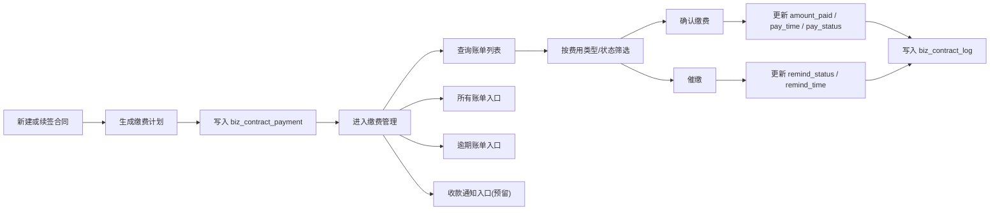

# BladeX 财务管理-缴费管理迁移清单

本文用于迁移 RuoYi 中“财务管理”下的二级菜单“缴费管理”到 BladeX。当前源端已经具备基础账单列表、确认缴费、催缴记录能力，但“所有账单”“逾期账单”“收款通知”更多还是菜单预埋和列表复用，不能按已完成功能理解。

## 1. 迁移边界

### 1.1 菜单定位

当前源端菜单结构：

| 层级 | 菜单 | 组件 | 现状路径 | 说明 |
| --- | --- | --- | --- | --- |
| 一级 | 财务管理 | `PageView` | `/finance` | 财务目录 |
| 二级 | 缴费管理 | `business/PaymentList` | `/settlementManage/payment` | 主账单管理页 |
| 二级 | 所有账单 | `business/PaymentList` | `/settlementManage/bills/all` | 复用同一页面 |
| 二级 | 逾期账单 | `business/PaymentList` | `/settlementManage/bills/overdue` | 复用同一页面 |
| 二级 | 收款通知 | `business/PaymentList` | `/settlementManage/payment-notice` | 仅菜单入口，未独立开发 |
| 二级 | 收支流水 | `business/PaymentList` | `/settlementManage/cash-flow` | 仅菜单入口，未独立开发 |

BladeX 目标建议：

```text
财务管理
  -> 缴费管理
```

在缴费管理页面内部拆分能力：

- 缴费管理主列表
- 所有账单入口
- 逾期账单入口
- 收款通知入口（预留）

### 1.2 本次迁移包含

- 财务管理一级菜单下“缴费管理”二级菜单。
- 账单列表。
- 费用类型、缴费状态、合同维度筛选。
- 确认缴费。
- 催缴记录。
- 合同账单联动查看。
- 所有账单入口。
- 逾期账单入口。
- 收款通知入口占位。

### 1.3 本次迁移不包含

本次只迁账单管理主流程，不深迁以下能力：

- 独立的“收款通知”业务编排。
- 通知发送渠道能力，如短信、邮件、站内消息、微信。
- 收支流水完整记账台账。
- 财务对账、核销、退款、冲销。
- 发票、开票、税务流程。
- 合同以外的其他应收来源。

### 1.4 特殊说明

- `所有账单`、`逾期账单`、`收款通知` 在源端已存在菜单 SQL。
- 但这几个菜单当前都指向 `business/PaymentList`，并没有完整独立页面或独立后端模型。
- `收款通知` 当前只具备“催缴记录”语义，不具备真正通知单主档。
- `逾期账单` 在 UI 字典中有状态 `2`，但源端未看到明确的自动逾期批处理或状态流转逻辑，需要在迁移时补足。

## 2. 现状清单

### 2.1 前端文件

| 文件 | 作用 |
| --- | --- |
| `ruoyi-ui/src/views/business/PaymentList.vue` | 缴费管理主页面 |
| `ruoyi-ui/src/api/business/contract.js` | 账单列表、确认缴费、催缴接口 |
| `ruoyi-ui/src/views/business/ContractList.vue` | 合同详情页账单页签、缴费确认、催缴入口 |
| `ruoyi-ui/src/views/business/modules/CustomerDetailDrawer.vue` | 客户详情中的账单展示 |
| `ruoyi-ui/src/views/business/ContractArchiveList.vue` | 合同归档中的缴费记录页签 |
| `ruoyi-ui/src/views/dashboard/Analysis.vue` | 首页租金收缴入口 |

### 2.2 后端文件

| 文件 | 作用 |
| --- | --- |
| `ruoyi-business/src/main/java/com/ruoyi/business/controller/ContractController.java` | 账单列表、按合同查询、确认缴费、催缴 |
| `ruoyi-business/src/main/java/com/ruoyi/business/service/ContractService.java` | 账单服务接口 |
| `ruoyi-business/src/main/java/com/ruoyi/business/service/impl/ContractServiceImpl.java` | 账单生成、确认缴费、催缴实现 |
| `ruoyi-business/src/main/java/com/ruoyi/business/domain/ContractPayment.java` | 账单实体 |
| `ruoyi-business/src/main/resources/mapper/business/ContractPaymentMapper.xml` | 账单表查询与更新 |
| `ruoyi-business/src/main/resources/mapper/business/ContractMapper.xml` | 合同基础信息与缴费周期字段 |
| `ruoyi-business/src/main/resources/mapper/business/CustomerMapper.xml` | 客户详情关联账单 |
| `ruoyi-business/src/main/resources/mapper/business/ContractLogMapper.xml` | 合同日志，记录 payment / remind 操作 |

### 2.3 SQL 文件

- `sql/contract_management.sql`
- `sql/menu_layout_consolidated.sql`
- `sql/settlement_bill_menus.sql`
- `sql/update_menu_entry_service_layout.sql`
- `sql/ry_ics.sql`

### 2.4 数据表

| 表名 | 作用 |
| --- | --- |
| `biz_contract` | 合同主表，账单生成来源 |
| `biz_contract_payment` | 合同缴费计划 / 账单主表 |
| `biz_contract_log` | 合同操作日志，记录缴费与催缴 |
| `biz_customer` | 客户名称、客户维度展示 |
| `ics_park` | 园区隔离 |

## 3. 核心业务现状

### 3.1 账单生成方式

源端账单不是人工录入主表，而是合同创建 / 续签时自动生成：

- 新建合同成功后调用 `generatePaymentPlan(contract)`。
- 合同续签新建后再次生成新账单计划。
- 按 `paymentCycle` 决定周期：
  - `monthly`
  - `quarterly`
  - `halfYear`
  - `yearly`
- 自动生成的费用类型包括：
  - `rent` 租金
  - `property` 物业费
  - `management` 管业管理费
  - `public` 公摊费

### 3.2 已实现能力

- [x] 全局账单列表查询。
- [x] 按合同查看账单。
- [x] 按费用类型筛选。
- [x] 按缴费状态筛选。
- [x] 确认缴费。
- [x] 催缴。
- [x] 合同日志记录缴费和催缴动作。

### 3.3 半成品或缺口

- [ ] `所有账单` 当前只是复用 `PaymentList` 菜单，没有专门视图语义。
- [ ] `逾期账单` 当前也是复用 `PaymentList` 菜单，没有明确按路由自动筛逾期。
- [ ] `收款通知` 当前没有独立表、独立页面、独立发送链路。
- [ ] `payStatus = 2` 虽然存在字典，但没有明确看到自动逾期任务。
- [ ] 账单编号没有独立字段，多个页面通过 `paymentId` 拼装 `ZD{paymentId}` 作为展示编号。

## 4. 功能模块清单

### 4.1 缴费管理主列表

- [ ] 展示账单列表。
- [ ] 支持按合同维度查看账单。
- [ ] 支持按费用类型筛选。
- [ ] 支持按缴费状态筛选。
- [ ] 展示合同编号。
- [ ] 展示客户名称。
- [ ] 展示费用类型。
- [ ] 展示账期开始和结束。
- [ ] 展示应收金额。
- [ ] 展示实收金额。
- [ ] 展示应缴日期。
- [ ] 展示缴费状态。
- [ ] 列表排序规则明确。

### 4.2 账单状态管理

源端状态定义：

| 状态值 | 含义 |
| --- | --- |
| `0` | 未缴 |
| `1` | 已缴 |
| `2` | 逾期 |
| `3` | 部分缴纳 |

迁移要求：

- [ ] 账单状态字典在 BladeX 中统一维护。
- [ ] 未缴、已缴、逾期、部分缴纳语义一致。
- [ ] 逾期状态判定规则明确。
- [ ] 部分缴纳状态要明确触发规则。
- [ ] 前后端状态码不能各写一套。

### 4.3 确认缴费

- [ ] 未缴账单可确认缴费。
- [ ] 逾期账单可确认缴费。
- [ ] 确认缴费时支持录入实收金额。
- [ ] 默认实收金额可带出应收金额。
- [ ] 确认后状态变为已缴或按规则进入部分缴纳。
- [ ] 更新实收金额、缴费时间、操作人。
- [ ] 写入合同日志。

### 4.4 催缴

- [ ] 未缴账单可催缴。
- [ ] 逾期账单可催缴。
- [ ] 催缴后更新 `remindStatus`。
- [ ] 催缴后更新 `remindTime`。
- [ ] 写入合同日志。
- [ ] 账单列表可见最近催缴状态。

### 4.5 所有账单

这是本次迁移中的“入口 + 视图语义”能力，建议基于缴费管理主列表扩展，而不是单独起一套模型。

- [ ] 建立“所有账单”入口。
- [ ] 进入后默认展示所有账单口径。
- [ ] 支持按园区、客户、合同、费用类型、账单状态筛选。
- [ ] 与缴费管理主列表复用同一后端分页接口或同一聚合查询服务。
- [ ] 页面文案明确这是总账单视图。

### 4.6 逾期账单

这是本次迁移中的“入口 + 逾期语义”能力，必须补清晰规则。

- [ ] 建立“逾期账单”入口。
- [ ] 进入后默认只展示逾期账单。
- [ ] 逾期判断规则至少明确两种实现方式之一：
- [ ] 方式 A：定时任务把超期未缴状态改为 `2`。
- [ ] 方式 B：查询时以 `pay_deadline < 当前日期 && pay_status != 1` 动态判定。
- [ ] 逾期列表支持确认缴费。
- [ ] 逾期列表支持催缴。
- [ ] 逾期数量需可用于首页或财务看板联动。

### 4.7 收款通知

按你的要求，这块先写入清单，当前只保留入口，不做完整开发。

- [ ] 建立“收款通知”菜单入口。
- [ ] 页面可先做占位页或禁用页签。
- [ ] 文档明确当前阶段暂不开发通知单主流程。
- [ ] 后续开发时建议独立模型，不要直接复用催缴按钮代替通知单。

后续扩展建议：

- [ ] 通知单主表。
- [ ] 通知单编号。
- [ ] 通知对象。
- [ ] 通知渠道。
- [ ] 发送状态。
- [ ] 回执状态。

## 5. API 清单

### 5.1 源端接口

```text
GET /business/contract/payment/list
GET /business/contract/payment/{contractId}
PUT /business/contract/payment/confirm/{paymentId}
PUT /business/contract/payment/remind/{paymentId}
GET /business/contract/log/{contractId}
GET /business/contract/expiring
```

### 5.2 BladeX 目标建议

建议 BladeX 把账单作为独立财务域接口，不继续挂在合同 Controller 之下。

```text
GET  /blade-ics/payment/page
GET  /blade-ics/payment/detail
GET  /blade-ics/payment/by-contract
POST /blade-ics/payment/confirm
POST /blade-ics/payment/remind
GET  /blade-ics/payment/overdue-page
GET  /blade-ics/payment/summary
GET  /blade-ics/payment/log-list
```

如果想先低成本迁移，也可保留合同域下的账单接口语义，但建议前端 API 文件按财务域拆分：

- `saber3/src/api/ics/payment.js`

## 6. 数据流走向



### 6.1 账单生成数据流

- 合同创建成功后自动生成缴费计划。
- 合同续签成功后为新合同再次生成账单。
- 每个缴费周期按费用类型拆成多条账单。
- 账单主键是 `payment_id`。
- 展示层账单编号目前由 `paymentId` 拼接而成。

### 6.2 查询数据流

- 用户进入缴费管理。
- 前端调用账单分页接口。
- 后端按当前用户是否管理员决定园区范围。
- Mapper 联表读取合同编号、客户名称。
- 前端渲染列表。

### 6.3 确认缴费数据流

- 用户点击确认缴费。
- 前端提交 `paymentId` 和实收金额。
- 后端校验账单归属园区。
- 后端更新实收金额、缴费时间、状态。
- 后端写入合同日志 `payment`。

### 6.4 催缴数据流

- 用户点击催缴。
- 后端校验账单归属园区。
- 后端更新 `remindStatus` 和 `remindTime`。
- 后端写入合同日志 `remind`。
- 当前阶段只落记录，不等于真实通知链路。

## 7. 关联模块

| 模块 | 关联方式 | 迁移要求 |
| --- | --- | --- |
| 合同管理 | 账单由合同生成 | 合同创建、续签必须保持账单生成能力 |
| 客户管理 | 账单展示客户名称 | 客户名称、客户状态要可追溯 |
| 首页 | 首页“租金收缴”入口跳转缴费管理 | 新路由必须回填到首页入口 |
| 合同归档 | 归档页查看缴费记录 | 合同维度账单查询必须保留 |
| 客户详情 | 客户详情展示账单 | 客户维度账单展示要兼容 |
| 财务看板 | 所有账单、逾期账单统计来源 | 口径要统一 |
| 系统通知 | 收款通知未来可能接入消息中心 | 当前只预留入口 |
| 日志审计 | 确认缴费、催缴写日志 | 操作日志不能丢 |
| 园区档案 | 非管理员按园区隔离 | 园区权限必须严格生效 |

## 8. BladeX 目标落点

### 8.1 后端建议

- 包名：`org.springblade.modules.ics`
- Controller：`PaymentController`
- Service：`IPaymentService`、`PaymentServiceImpl`
- Entity / VO：
  - `Payment`
  - `PaymentPageReq`
  - `PaymentDetailVO`
  - `PaymentSummaryVO`
  - `PaymentNoticePlaceholderVO`
- Mapper：
  - 可复用合同账单 Mapper。
  - 若需要复杂统计，可新增 `PaymentMapper`。

BladeX 规范建议：

- 统一返回 `R.data(...)`。
- 分页使用 `Query`、`IPage`。
- 使用 BladeX 用户上下文获取当前用户、租户和权限范围。
- 若有数据权限，优先在服务层和查询构造器中统一收口。

### 8.2 前端建议

- API：`saber3/src/api/ics/payment.js`
- 页面：`saber3/src/views/ics/payment/index.vue`
- 子视图或页签：
  - `BillListTab`
  - `AllBillsTab`
  - `OverdueBillsTab`
  - `PaymentNoticePlaceholderTab`

## 9. 迁移顺序

### 9.1 第一阶段：菜单与主列表

- [ ] 建立“财务管理”一级菜单。
- [ ] 建立“缴费管理”二级菜单。
- [ ] 迁移账单列表页。
- [ ] 迁移费用类型、缴费状态筛选。
- [ ] 迁移合同编号、客户、账期、金额、状态展示。

### 9.2 第二阶段：确认缴费与催缴

- [ ] 迁移确认缴费接口。
- [ ] 迁移确认缴费弹窗。
- [ ] 迁移催缴接口。
- [ ] 迁移催缴状态显示。
- [ ] 迁移合同日志写入与查看。

### 9.3 第三阶段：所有账单与逾期账单

- [ ] 建立“所有账单”入口。
- [ ] 建立“逾期账单”入口。
- [ ] 补齐逾期口径。
- [ ] 验证入口默认筛选是否生效。
- [ ] 验证从首页、合同、客户详情跳转是否一致。

### 9.4 第四阶段：收款通知入口预留

- [ ] 建立“收款通知”入口。
- [ ] 页面显示“待开发”或占位视图。
- [ ] 在清单中登记后续扩展项。
- [ ] 确保不会误导用户把催缴按钮当成收款通知模块。

## 10. 并行 Work Tree 切片

| Work Tree | 负责内容 | 输出物 | 依赖 |
| --- | --- | --- | --- |
| WT-A | 菜单、页面骨架、账单列表 | 缴费管理可访问 | BladeX 菜单体系 |
| WT-B | 确认缴费、催缴、日志 | 主流程可用 | 账单表、合同日志 |
| WT-C | 所有账单、逾期账单入口 | 入口与筛选语义完整 | 逾期规则明确 |
| WT-D | 收款通知预留入口 | 占位页、后续设计说明 | 无真实通知链路依赖 |
| WT-E | 联调与验收 | 校验报告 | WT-A 到 WT-D |

## 11. 数据模型缺口

迁移前建议先确认以下建模问题：

- [ ] 是否要为账单新增真实 `bill_no` 字段，而不是继续用 `paymentId` 拼装。
- [ ] 部分缴纳时是否允许多次收款明细；如果允许，后续应增加收款流水子表。
- [ ] 逾期状态是持久化字段还是动态计算字段。
- [ ] 收款通知是否独立建主表。
- [ ] 是否要增加账单通知日志表。

## 12. 数据校验 SQL

### 12.1 基础账单数量

```sql
SELECT COUNT(*) AS payment_total
FROM biz_contract_payment;

SELECT COUNT(*) AS unpaid_total
FROM biz_contract_payment
WHERE pay_status = '0';

SELECT COUNT(*) AS paid_total
FROM biz_contract_payment
WHERE pay_status = '1';

SELECT COUNT(*) AS overdue_total
FROM biz_contract_payment
WHERE pay_status = '2';
```

### 12.2 动态逾期排查

如果当前系统没有批处理更新逾期状态，建议额外核对动态逾期数量：

```sql
SELECT COUNT(*) AS dynamic_overdue_total
FROM biz_contract_payment
WHERE pay_status <> '1'
  AND pay_deadline < CURDATE();
```

### 12.3 催缴状态

```sql
SELECT COUNT(*) AS reminded_total
FROM biz_contract_payment
WHERE remind_status = '1';
```

### 12.4 园区脏数据

```sql
SELECT 'payment_orphan_contract' AS check_item, COUNT(*) AS invalid_count
FROM biz_contract_payment p
LEFT JOIN biz_contract c ON c.contract_id = p.contract_id
WHERE c.contract_id IS NULL
UNION ALL
SELECT 'payment_orphan_park', COUNT(*)
FROM biz_contract_payment p
LEFT JOIN ics_park pk ON pk.id = p.park_id
WHERE p.park_id IS NOT NULL AND pk.id IS NULL;
```

## 13. 校验清单

### 13.1 菜单校验

- [ ] 一级菜单“财务管理”可见。
- [ ] 二级菜单“缴费管理”可点。
- [ ] “所有账单”入口可点。
- [ ] “逾期账单”入口可点。
- [ ] “收款通知”入口可点，但明确为预留。
- [ ] 菜单权限配置正确。

### 13.2 主流程校验

- [ ] 账单列表可正常加载。
- [ ] 费用类型筛选生效。
- [ ] 缴费状态筛选生效。
- [ ] 合同维度查询生效。
- [ ] 确认缴费后金额、状态、时间更新正确。
- [ ] 催缴后催缴状态和时间更新正确。
- [ ] 合同日志中可看到 `payment`、`remind` 记录。

### 13.3 所有账单与逾期账单校验

- [ ] “所有账单”默认不丢数据。
- [ ] “逾期账单”默认筛出逾期数据。
- [ ] 逾期账单可以继续确认缴费。
- [ ] 逾期账单可以继续催缴。
- [ ] 逾期数量与 SQL 口径一致。
- [ ] 从首页、合同详情、客户详情跳转的过滤条件一致。

### 13.4 收款通知校验

- [ ] “收款通知”当前阶段明确为占位入口。
- [ ] 页面不误显示成已完成功能。
- [ ] 文案清楚说明暂未开发。
- [ ] 后续扩展项已在清单中登记。

### 13.5 权限与数据范围校验

- [ ] 非管理员只能看到本园区账单。
- [ ] 管理员可查看全量或授权范围账单。
- [ ] 确认缴费不能跨园区操作。
- [ ] 催缴不能跨园区操作。
- [ ] 合同不存在或无权限时不能查看对应账单。

### 13.6 关联模块校验

- [ ] 新建合同后账单按周期自动生成。
- [ ] 续签合同后新合同账单自动生成。
- [ ] 客户详情账单视图可用。
- [ ] 合同归档账单视图可用。
- [ ] 首页“租金收缴”入口跳转到 BladeX 新路由。

## 14. 迁移完成定义

本模块迁移完成必须同时满足：

- [ ] BladeX 中“财务管理 -> 缴费管理”已可用。
- [ ] 账单列表、确认缴费、催缴主流程可用。
- [ ] “所有账单”和“逾期账单”入口有真实语义。
- [ ] “收款通知”已留入口并标注暂不开发。
- [ ] 园区权限、日志、金额、状态全部核对通过。
- [ ] 逾期口径已定稿，不再处于模糊状态。
- [ ] 账单编号策略已确认。
