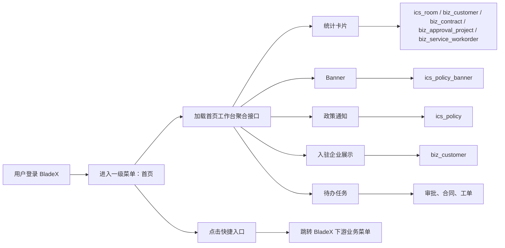

# BladeX 首页迁移清单

本文用于迁移 RuoYi 中“首页”到 BladeX。首页不是单一 CRUD，也不是某个业务模块的详情页，而是园区运营工作台：聚合房源、客户、合同、审批、工单、政策通知和快捷入口，给运营人员提供进入各业务模块的第一屏。

## 1. 迁移边界

### 1.1 菜单定位

RuoYi 当前菜单存在两层：

| 层级 | 菜单 | 组件 | 现状路径 | 说明 |
| --- | --- | --- | --- | --- |
| 一级 | `驾驶舱` / 已改名 `首页` | `PageView` | `/dashboard` | 源端目录菜单 |
| 二级 | `首页` | `dashboard/Analysis` | `/dashboard/analysis` | 实际工作台页面 |

BladeX 目标建议收口为一级菜单：

```text
首页
```

迁移时不要再保留“首页 -> 首页”的双层结构。首页一级菜单直接承载工作台页面，登录后默认进入该页面。

### 1.2 本次迁移包含

- 首页菜单、默认路由、权限入口。
- 工作台统计卡片。
- 工作台 Banner。
- 招商闭环入口。
- 园区政策通知。
- 快捷入口。
- 入驻企业展示。
- 日程安排。
- 待办任务提醒。
- 审批超时提醒。
- 下游模块跳转路由适配。

### 1.3 本次迁移不包含

首页只迁聚合展示和入口能力，不在本次深迁以下模块：

- 楼层管理 / 房源管理 CRUD。
- 客户管理 CRUD。
- 合同管理 CRUD。
- 审批中心完整流程。
- 物业工单完整流程。
- 政策管理和 Banner 管理后台。
- 租控管理页面。
- 财务收缴页面。

这些模块只作为首页的数据来源或跳转目标纳入校验。

## 2. 现状清单

### 2.1 前端源文件

| 文件 | 作用 |
| --- | --- |
| `ruoyi-ui/src/views/dashboard/Analysis.vue` | 首页工作台主页面 |
| `ruoyi-ui/src/api/business/room.js` | 房源数量、合同到期提醒、租控入口相关 API |
| `ruoyi-ui/src/api/business/customer.js` | 客户数量、入驻企业展示 API |
| `ruoyi-ui/src/api/business/contract.js` | 合同列表兜底 API |
| `ruoyi-ui/src/api/business/approval.js` | 审批待办、审批超时 API |
| `ruoyi-ui/src/api/business/propertyService.js` | 物业工单待办 API |
| `ruoyi-ui/src/api/business/policy.js` | 园区政策通知 API |
| `ruoyi-ui/src/api/business/policyBanner.js` | 首页 Banner API |
| `ruoyi-ui/src/utils/routerUtil.js` | 登录默认跳转 `/dashboard/analysis` |
| `ruoyi-ui/src/permission.js` | 默认路由配置 |
| `ruoyi-ui/src/layouts/BasicLayout.vue` | 首页侧边栏显示逻辑 |

### 2.2 后端源文件

| 文件 | 作用 |
| --- | --- |
| `ruoyi-business/src/main/java/com/ruoyi/business/controller/RoomController.java` | 房源列表、合同到期提醒 |
| `ruoyi-business/src/main/java/com/ruoyi/business/controller/CustomerController.java` | 客户列表 |
| `ruoyi-business/src/main/java/com/ruoyi/business/controller/ContractController.java` | 合同列表兜底 |
| `ruoyi-business/src/main/java/com/ruoyi/business/controller/ApprovalController.java` | 审批待办、超时审批 |
| `ruoyi-business/src/main/java/com/ruoyi/business/controller/PropertyServiceController.java` | 物业工单 |
| `ruoyi-business/src/main/java/com/ruoyi/business/controller/PolicyController.java` | 首页政策通知 |
| `ruoyi-business/src/main/java/com/ruoyi/business/controller/PolicyBannerController.java` | 首页工作台 Banner |
| `ruoyi-business/src/main/resources/mapper/business/RoomMapper.xml` | 房源数据、租控相关统计 |
| `ruoyi-business/src/main/resources/mapper/business/CustomerMapper.xml` | 客户列表、企业展示 |
| `ruoyi-business/src/main/resources/mapper/business/ContractMapper.xml` | 合同到期和合同兜底 |
| `ruoyi-business/src/main/resources/mapper/business/ApprovalProjectMapper.xml` | 审批项目列表 |
| `ruoyi-business/src/main/resources/mapper/business/ServiceWorkorderMapper.xml` | 工单待办 |
| `ruoyi-business/src/main/resources/mapper/business/PolicyMapper.xml` | 政策通知 |
| `ruoyi-business/src/main/resources/mapper/business/PolicyBannerMapper.xml` | Banner 查询 |

### 2.3 SQL 与菜单源

- `sql/ry_ics.sql`
  - `menu_id = 4`：原“驾驶舱”目录。
  - `menu_id = 600`：`dashboard/Analysis` 首页页面。
- `sql/update_dashboard_menu_name.sql`
- `sql/update_termination_menu.sql`
- `sql/menu_layout_consolidated.sql`
- `sql/workbench_policy_notice.sql`

### 2.4 数据表

| 表名 | 首页用途 |
| --- | --- |
| `ics_room` | 楼层管理统计、房源入口 |
| `ics_building` | 房源楼栋关联 |
| `ics_park` | 园区隔离与园区名称 |
| `biz_customer` | 客户数量、入驻企业展示、企业风险入口 |
| `biz_contract` | 合同即将到期提醒 |
| `biz_approval_project` | 审批待处理、项目审核入口、超时审批 |
| `biz_approval_log` | 审批处理轨迹，辅助判断待办 |
| `biz_service_workorder` | 物业工单待处理提醒 |
| `biz_property_service` | 工单服务项名称 |
| `ics_policy` | 园区政策通知 |
| `ics_policy_banner` | 首页工作台 Banner |

## 3. 功能模块清单

### 3.1 首页菜单与默认路由

- [ ] 建立 BladeX 一级菜单“首页”。
- [ ] 菜单类型建议为页面菜单，不再额外挂二级“首页”。
- [ ] 登录成功默认进入首页。
- [ ] 首页刷新后路由可恢复。
- [ ] 首页不显示空白侧边栏。
- [ ] 首页菜单图标、排序、权限编码与 BladeX 菜单体系一致。
- [ ] 非管理员用户有首页访问权限。
- [ ] 无首页权限时不应该作为默认跳转页。

### 3.2 统计卡片

当前首页有 5 个统计卡片：

| 卡片 | 源端取数 | 现状跳转 | 迁移要求 |
| --- | --- | --- | --- |
| 楼层管理 | `GET /business/room/list?pageNum=1&pageSize=1` | `/parkManage/floorManage` | 展示房源总数或楼层管理口径，目标路由改为 BladeX 楼层/房源路径 |
| 客户管理 | `GET /business/customer/list?pageNum=1&pageSize=12` | `/business/customer` | 展示客户总数，并复用前 12 条企业数据 |
| 合同即将到期 | `GET /business/room/contract/reminders` | `/assetManage/contract` | 展示即将到期合同数量 |
| 审批待处理 | `GET /business/approval/project/list?scope=todo` | `/assetManage/approval/todo?scope=todo` | 展示当前登录人待办审批数量 |
| 待办任务 | `GET /business/propertyService/workorder/list?status=0` | `/business/propertyService/workorder` | 展示待处理物业工单数量 |

迁移检查：

- [ ] 每张卡片接口成功时显示正确数字。
- [ ] 接口失败时显示 `0`，页面不崩溃。
- [ ] 数字口径必须写入后端注释或接口文档。
- [ ] 点击“详情”跳转到 BladeX 新路由。
- [ ] 非管理员数据按当前租户、部门、园区或授权范围过滤。

### 3.3 工作台 Banner

源端接口：

```text
GET /business/policyBanner/workbench
```

源端字段：

| 字段 | 用途 |
| --- | --- |
| `name` | Banner 标题 |
| `bannerDesc` | Banner 描述 |
| `bannerImg` | Banner 图片 |
| `isMarketable` | 是否上架 |
| `marketableTime` | 上架时间，排序用 |

迁移要求：

- [ ] 查询最新一条已上架、未删除 Banner。
- [ ] 没有 Banner 时使用默认标题、默认描述、默认图。
- [ ] 相对路径图片需要拼接 BladeX 资源访问前缀。
- [ ] 远程 URL、协议相对 URL、Base64 图片都能正常展示。
- [ ] Banner 图片加载失败时不影响首页其他区域。
- [ ] 后续若迁政策/Banner 管理，首页只消费其结果，不在首页做管理动作。

### 3.4 招商闭环入口

当前固定入口：

| 入口 | 当前路由 | 关联模块 | 迁移要求 |
| --- | --- | --- | --- |
| 租金收缴 | `/settlementManage/payment` | 财务管理 / 收缴管理 | 路由映射到 BladeX 收缴页面 |
| 企业风险 | `/business/customer?riskLevel=3` | 客户管理 | 保留高风险筛选参数 |
| 项目审核 | `/business/ApprovalProjectList` | 审批中心 / 入驻审批 | 路由映射到项目审核页面 |
| 客户管理 | `/business/customer` | 客户管理 | 路由映射到客户档案页面 |

迁移要求：

- [ ] 入口文案、图标、描述保持可识别。
- [ ] 未迁完的目标模块先给禁用态或跳转到已迁页面。
- [ ] 带参数跳转的入口必须验证参数仍被目标页面识别。
- [ ] 首页不直接处理招商、审批、收缴业务，只做入口聚合。

### 3.5 园区政策通知

源端接口：

```text
GET /business/policy/notice
```

源端逻辑：

- 从 `ics_policy` 读取未删除政策。
- 按 `marketable_time`、`update_time`、`create_time`、`id` 倒序。
- 后端最多返回 5 条。
- 首页展示前 3 条。
- 有 `linkUrl` 时打开链接或路由。
- 无 `linkUrl` 时跳转政策管理。

迁移要求：

- [ ] 首页展示 3 条最新政策通知。
- [ ] 无政策时显示空状态。
- [ ] 外链使用新窗口打开。
- [ ] 内部链接使用 BladeX 路由跳转。
- [ ] 无链接时跳转到 BladeX 政策管理或政策列表。
- [ ] 政策展示口径要确认是否需要 `is_marketable = 1`。源端当前只过滤 `del_flag = 0`，迁移时建议补齐上架过滤。
- [ ] 园区隔离口径要确认。源端首页通知未按 `park_id` 过滤，迁移时建议按当前园区或租户过滤。

### 3.6 快捷入口

当前固定入口：

| 入口 | 当前路由 | 迁移目标 |
| --- | --- | --- |
| 新增客户 | `/business/customer` | 客户管理页面，必要时打开新增弹窗 |
| 楼层管理 | `/parkManage/floorManage` | 园区资产 / 楼层管理 |
| 新建合同 | `/assetManage/contract` | 合同管理页面，必要时打开新增弹窗 |
| 我的审批 | `/assetManage/approval/todo?scope=todo` | 审批中心 / 我的审批 |
| 物业工单 | `/business/propertyService/workorder` | 企业服务 / 我的物业服务 / 工单 |
| 租控管理 | `/parkManage/floorBoard` | 园区资产 / 租控管理 |

迁移要求：

- [ ] 6 个快捷入口全部保留。
- [ ] 已迁模块跳转到真实页面。
- [ ] 未迁模块先记录为阻塞项，避免点击 404。
- [ ] `我的审批` 的 `scope=todo` 参数仍然生效。
- [ ] 新增类入口是否直接打开弹窗，需要和目标页面交互约定一致。

### 3.7 入驻企业展示

源端取数：

```text
GET /business/customer/list?pageNum=1&pageSize=12
```

展示字段：

| 字段 | 用途 |
| --- | --- |
| `customerId` / `id` | 跳转详情 |
| `enterpriseName` | 企业名称 |
| `industry` | 行业 |

迁移要求：

- [ ] 默认展示最多 12 家企业。
- [ ] 企业名称为空时兜底显示 `-`。
- [ ] 行业为空时显示 `未填写行业`。
- [ ] 企业短名生成规则保留或迁移为工具方法。
- [ ] 点击企业详情跳转客户管理并携带 `customerId`。
- [ ] 无企业数据时显示空状态。
- [ ] 跑马灯动画不能因数据重复导致 key 冲突。

### 3.8 日程安排

源端为纯前端日历组件，没有后端接口。

迁移要求：

- [ ] BladeX 前端保留日历区域。
- [ ] 不引入新的日程业务表。
- [ ] 若后续接入日程模块，单独建迁移清单。
- [ ] 移动端和窄屏下日历区域不挤压主内容。

### 3.9 待办任务提醒

当前待办包含 4 类：

| 提醒 | 源端接口 | 迁移要求 |
| --- | --- | --- |
| 审批待处理提醒 | `/business/approval/project/list?scope=todo` | 展示当前人待处理审批数量 |
| 合同到期提醒 | `/business/room/contract/reminders` | 展示即将到期合同数量 |
| 物业工单提醒 | `/business/propertyService/workorder/list?status=0` | 展示待处理工单数量 |
| 审批超时提醒 | `/business/approval/project/timeout` | 展示超过 12 小时未处理审批数量 |

迁移要求：

- [ ] 四类提醒全部展示。
- [ ] 数量为 0 时显示“暂无...”文案。
- [ ] 审批超时阈值沿用 12 小时，或在目标后端做配置化。
- [ ] “更多”跳转到我的审批待办。
- [ ] 工单状态 `0` 在 BladeX 字典中必须明确为待处理。
- [ ] 合同到期提醒要确认到期天数口径。

## 4. API 清单

### 4.1 源端 API

```text
GET /business/room/list
GET /business/customer/list
GET /business/room/contract/reminders
GET /business/contract/list
GET /business/approval/project/list
GET /business/approval/project/timeout
GET /business/propertyService/workorder/list
GET /business/policyBanner/workbench
GET /business/policy/notice
```

### 4.2 BladeX 目标建议

建议首页后端增加聚合接口，减少首页首屏同时打多个业务接口造成的闪烁和权限口径不一致。

```text
GET /blade-ics/home/workbench
GET /blade-ics/home/overview
GET /blade-ics/home/banner
GET /blade-ics/home/policy-notice
GET /blade-ics/home/todo
```

推荐返回结构：

```json
{
  "overview": {
    "roomCount": 0,
    "customerCount": 0,
    "expiringContractCount": 0,
    "approvalTodoCount": 0,
    "workorderTodoCount": 0
  },
  "banner": {
    "name": "智慧园区工作台",
    "bannerDesc": "聚合房源、客户、合同、审批与任务，助力园区高效运营",
    "imageUrl": "/image.png"
  },
  "policyNotices": [],
  "enterprises": [],
  "todos": {
    "approvalTodoCount": 0,
    "expiringContractCount": 0,
    "workorderTodoCount": 0,
    "timeoutApprovalCount": 0
  }
}
```

如果为降低第一阶段改动，也可以先沿用多接口调用，但必须保证权限口径和空状态一致。

## 5. 数据流走向



### 5.1 首屏加载数据流

- 用户登录后进入首页。
- 前端请求首页聚合接口。
- 后端根据当前用户、租户、部门、园区权限计算可见数据。
- 后端并行或分段查询房源、客户、合同、审批、工单、Banner、政策。
- 前端渲染统计卡片、Banner、政策、企业展示和待办提醒。

### 5.2 跳转数据流

- 用户点击统计卡片或快捷入口。
- 前端根据 BladeX 路由映射跳转目标页面。
- 目标页面自行加载业务数据。
- 首页不携带旧 RuoYi 路径，只保留目标 BladeX 路由。

### 5.3 异常数据流

- 某一业务接口异常时，首页其他模块继续展示。
- 单项数据异常只影响对应卡片或区域。
- 空列表显示空状态，不显示接口错误堆栈。
- 需要记录后端日志，便于排查首页首屏异常。

## 6. 关联模块

| 关联模块 | 关联方式 | 迁移要求 |
| --- | --- | --- |
| 园区档案 | 首页数据按园区隔离 | 园区、楼栋、楼层、房间底座必须先可查 |
| 楼层管理 | 统计卡片和快捷入口 | 目标路由要能访问 |
| 租控管理 | 快捷入口 | 未迁完时不能出现 404 |
| 客户管理 | 客户统计、企业展示、企业风险入口 | 客户列表、详情参数、风险筛选要可用 |
| 合同管理 | 合同到期提醒、合同入口 | 合同到期口径要和合同模块一致 |
| 审批中心 | 审批待办、超时审批、我的审批入口 | 当前用户待办识别必须准确 |
| 企业服务-物业服务 | 工单待办、物业工单入口 | 工单状态字典要统一 |
| 政策服务 | 政策通知 | 政策链接、上架状态、园区隔离要明确 |
| Banner 管理 | 工作台 Banner | 图片资源访问链路要打通 |
| 财务管理 | 租金收缴入口 | 收缴路由和权限要存在 |
| 系统菜单权限 | 首页菜单和下游入口 | BladeX 菜单、角色、按钮权限要配置 |
| 文件/资源服务 | Banner 图片展示 | 相对路径和资源域名要正确 |

## 7. BladeX 目标落点

### 7.1 后端建议

如果当前 BladeX 是 Boot 单体，建议落到现有业务模块：

- 包名：`org.springblade.modules.ics`
- Controller：`HomeController`
- Service：`IHomeService`、`HomeServiceImpl`
- DTO / VO：
  - `HomeWorkbenchVO`
  - `HomeOverviewVO`
  - `HomeBannerVO`
  - `HomePolicyNoticeVO`
  - `HomeEnterpriseVO`
  - `HomeTodoVO`
- Mapper：
  - 可复用房源、客户、合同、审批、工单、政策、Banner Mapper。
  - 首页复杂查询可单独放 `HomeMapper`。

BladeX 规范要求：

- 统一返回 `R.data(...)`。
- 分页列表使用 BladeX `Query`、`IPage` 或已存在项目规范。
- 当前用户使用 BladeX 认证上下文获取，不再使用 RuoYi `getLoginName()`、`getParkId()`。
- 权限建议使用 `@PreAuth` 或菜单权限配置。
- 主键沿用 BladeX 雪花 ID 规范，首页只读接口不产生业务主键。

### 7.2 前端建议

- API：`saber3/src/api/ics/home.js`
- 页面：`saber3/src/views/ics/home/index.vue`
- 组件：
  - `components/StatCards.vue`
  - `components/WorkbenchBanner.vue`
  - `components/LifecycleEntrances.vue`
  - `components/PolicyNotice.vue`
  - `components/ShortcutGrid.vue`
  - `components/EnterpriseMarquee.vue`
  - `components/TodoPanel.vue`

如果目标前端仍使用 Saber Vue2，则按现有 BladeX 前端目录替换对应路径，但模块拆分边界保持一致。

## 8. 迁移顺序

### 8.1 第一阶段：首页菜单与页面骨架

- [ ] 建立 BladeX 一级菜单“首页”。
- [ ] 设置登录默认路由。
- [ ] 新建首页页面。
- [ ] 搭建统计卡片、Banner、主内容、右侧待办基本布局。
- [ ] 接入静态 mock 数据，先保证页面可打开。

### 8.2 第二阶段：首页聚合接口

- [ ] 新增首页聚合 VO。
- [ ] 新增首页 Controller。
- [ ] 新增首页 Service。
- [ ] 接入房源数量。
- [ ] 接入客户数量。
- [ ] 接入合同到期数量。
- [ ] 接入审批待办数量。
- [ ] 接入工单待办数量。
- [ ] 接入超时审批数量。
- [ ] 接入空值和异常兜底。

### 8.3 第三阶段：Banner、政策、企业展示

- [ ] 迁移工作台 Banner 查询。
- [ ] 迁移 Banner 图片 URL 处理。
- [ ] 迁移政策通知查询。
- [ ] 补齐政策上架和园区过滤口径。
- [ ] 迁移企业展示数据。
- [ ] 验证企业详情跳转参数。

### 8.4 第四阶段：快捷入口和路由映射

- [ ] 梳理首页所有旧 RuoYi 路由。
- [ ] 建立 BladeX 新路由映射表。
- [ ] 已迁模块直接跳转。
- [ ] 未迁模块做禁用、占位页或迁移阻塞记录。
- [ ] 验证所有卡片和入口不出现 404。

### 8.5 第五阶段：权限、数据范围、体验验收

- [ ] 管理员可看到全量或授权园区数据。
- [ ] 普通运营人员只能看到授权范围数据。
- [ ] 多租户场景不能串租户。
- [ ] 首页首屏加载速度可接受。
- [ ] 某个下游接口失败不影响首页整体。
- [ ] 桌面端、笔记本宽度、移动端布局都可用。

## 9. 并行 Work Tree 切片

建议首页迁移单独开一个 Work Tree，不和客户、合同、审批等下游模块混在一起。

| Work Tree | 负责内容 | 输出物 | 依赖 |
| --- | --- | --- | --- |
| WT-A | 菜单、默认路由、页面骨架 | 首页可访问、静态布局 | BladeX 前端菜单体系 |
| WT-B | 首页聚合后端接口 | `/blade-ics/home/workbench` | 房源、客户、合同、审批、工单表可查 |
| WT-C | Banner、政策、企业展示 | Banner/政策/企业区域可用 | `ics_policy_banner`、`ics_policy`、`biz_customer` |
| WT-D | 快捷入口和权限校验 | 入口路由映射、角色权限 | 下游菜单迁移状态 |
| WT-E | 首页联调与验收 | 校验报告、问题清单 | WT-A 到 WT-D 合并后 |

合并顺序建议：

```text
WT-A -> WT-B -> WT-C -> WT-D -> WT-E
```

## 10. 路由映射清单

| 首页入口 | RuoYi 旧路由 | BladeX 新路由 | 状态 |
| --- | --- | --- | --- |
| 首页默认页 | `/dashboard/analysis` | 待定：`/ics/home` 或 `/home` | 待确认 |
| 楼层管理 | `/parkManage/floorManage` | 待定：园区资产 / 楼层管理 | 待确认 |
| 客户管理 | `/business/customer` | 待定：客户管理 | 待确认 |
| 合同管理 | `/assetManage/contract` | 待定：合同管理 | 待确认 |
| 我的审批 | `/assetManage/approval/todo?scope=todo` | 待定：审批中心 / 我的审批 | 待确认 |
| 物业工单 | `/business/propertyService/workorder` | 待定：企业服务 / 我的物业服务 | 待确认 |
| 租控管理 | `/parkManage/floorBoard` | 待定：园区资产 / 租控管理 | 待确认 |
| 租金收缴 | `/settlementManage/payment` | 待定：财务管理 / 租金收缴 | 待确认 |
| 企业风险 | `/business/customer?riskLevel=3` | 待定：客户管理，高风险筛选 | 待确认 |
| 项目审核 | `/business/ApprovalProjectList` | 待定：审批中心 / 项目审核 | 待确认 |
| 政策通知 | `/business/policy/policyManage` 或 `linkUrl` | 待定：政策服务 | 待确认 |

迁移时必须把“待确认”逐条改为真实 BladeX 路由。

## 11. 数据校验 SQL

以下 SQL 用于迁移前后核对首页数据口径。表名以当前源端业务表为准，若 BladeX 已改表名，需要替换为目标表。

### 11.1 基础数量

```sql
SELECT COUNT(*) AS room_count
FROM ics_room;

SELECT COUNT(*) AS customer_count
FROM biz_customer
WHERE del_flag = '0';

SELECT COUNT(*) AS workorder_todo_count
FROM biz_service_workorder
WHERE del_flag = '0'
  AND order_status = '0';
```

### 11.2 合同到期提醒

具体到期天数以迁移后的合同服务口径为准，建议先明确 30 天、60 天还是 90 天。

```sql
SELECT COUNT(*) AS expiring_contract_count
FROM biz_contract
WHERE del_flag = '0'
  AND contract_status = '1'
  AND end_date >= CURDATE()
  AND end_date <= DATE_ADD(CURDATE(), INTERVAL 90 DAY);
```

### 11.3 审批待办和超时

审批待办强依赖当前登录人，SQL 只能做辅助排查，最终以接口为准。

```sql
SELECT COUNT(*) AS approval_todo_total
FROM biz_approval_project
WHERE del_flag = '0'
  AND status IN ('1', '2');

SELECT COUNT(*) AS approval_timeout_total
FROM biz_approval_project
WHERE del_flag = '0'
  AND status IN ('1', '2')
  AND update_time < DATE_SUB(NOW(), INTERVAL 12 HOUR);
```

### 11.4 Banner 与政策

```sql
SELECT id, name, banner_desc, banner_img, marketable_time
FROM ics_policy_banner
WHERE del_flag = 0
  AND is_marketable = 1
ORDER BY marketable_time DESC, update_time DESC, create_time DESC, id DESC
LIMIT 1;

SELECT id, name, link_url, marketable_time
FROM ics_policy
WHERE del_flag = 0
ORDER BY marketable_time DESC, update_time DESC, create_time DESC, id DESC
LIMIT 5;
```

### 11.5 关联脏数据

迁移首页前建议这些校验结果为 0：

```sql
SELECT 'room_orphan_park' AS check_item, COUNT(*) AS invalid_count
FROM ics_room r
LEFT JOIN ics_park p ON p.id = r.park_id
WHERE r.park_id IS NOT NULL AND p.id IS NULL
UNION ALL
SELECT 'room_orphan_building', COUNT(*)
FROM ics_room r
LEFT JOIN ics_building b ON b.id = r.building_id
WHERE r.building_id IS NOT NULL AND b.id IS NULL
UNION ALL
SELECT 'customer_contract_orphan', COUNT(*)
FROM biz_contract c
LEFT JOIN biz_customer cu ON cu.customer_id = c.customer_id
WHERE c.customer_id IS NOT NULL AND cu.customer_id IS NULL
UNION ALL
SELECT 'workorder_orphan_customer', COUNT(*)
FROM biz_service_workorder w
LEFT JOIN biz_customer cu ON cu.customer_id = w.customer_id
WHERE w.customer_id IS NOT NULL AND cu.customer_id IS NULL;
```

## 12. 校验清单

### 12.1 菜单校验

- [ ] BladeX 左侧或顶部菜单存在一级菜单“首页”。
- [ ] 首页菜单排序在第一个。
- [ ] 登录后默认进入首页。
- [ ] 刷新首页不跳 404。
- [ ] 首页没有重复二级“首页”。
- [ ] 普通角色授权后可访问首页。
- [ ] 未授权角色不可绕过菜单访问。

### 12.2 首屏展示校验

- [ ] 5 张统计卡片全部展示。
- [ ] Banner 标题、描述、图片展示正常。
- [ ] 招商闭环入口 4 项展示正常。
- [ ] 政策通知最多展示 3 条。
- [ ] 快捷入口 6 项展示正常。
- [ ] 入驻企业展示最多展示 12 条。
- [ ] 日历区域展示正常。
- [ ] 待办任务 4 项展示正常。
- [ ] 空数据状态不影响页面布局。

### 12.3 数据口径校验

- [ ] 房源/楼层统计与目标表一致。
- [ ] 客户数量与客户管理列表一致。
- [ ] 入驻企业展示与客户列表前 12 条一致。
- [ ] 合同即将到期数量与合同模块一致。
- [ ] 审批待处理数量与我的审批待办一致。
- [ ] 审批超时数量与超时接口一致。
- [ ] 物业工单数量与工单列表待处理状态一致。
- [ ] 政策通知排序与 SQL 排序一致。
- [ ] Banner 取最新上架数据。

### 12.4 跳转校验

- [ ] 楼层管理入口可打开。
- [ ] 客户管理入口可打开。
- [ ] 合同管理入口可打开。
- [ ] 我的审批入口可打开并保留 `scope=todo`。
- [ ] 物业工单入口可打开。
- [ ] 租控管理入口可打开。
- [ ] 租金收缴入口可打开。
- [ ] 企业风险入口可打开并保留 `riskLevel=3`。
- [ ] 项目审核入口可打开。
- [ ] 政策通知外链可新窗口打开。
- [ ] 政策通知内链可正常路由跳转。
- [ ] 企业详情携带 `customerId` 参数。

### 12.5 权限与数据范围校验

- [ ] 管理员看到的数据范围符合产品定义。
- [ ] 普通用户只能看到授权园区数据。
- [ ] 多租户数据不串租户。
- [ ] 首页聚合接口不能返回无权限企业名称。
- [ ] 首页跳转下游模块后，下游模块权限仍然生效。
- [ ] 没有下游菜单权限时，对应入口需要隐藏、禁用或提示无权限。

### 12.6 异常与性能校验

- [ ] 任意一个业务数据源异常时首页仍可打开。
- [ ] 后端接口返回空数据时前端不报错。
- [ ] Banner 图片 404 时页面不崩。
- [ ] 首页首屏接口数量可控，建议优先使用聚合接口。
- [ ] 首屏加载时间符合项目要求。
- [ ] 浏览器控制台无接口 404、权限 403、未捕获异常。
- [ ] 移动端和小屏幕下文本不重叠、不溢出。

## 13. 迁移完成定义

首页迁移完成必须同时满足：

- [ ] BladeX 首页菜单、路由、权限可用。
- [ ] 首页所有展示模块都有真实数据或明确空状态。
- [ ] 统计卡片、待办提醒、政策、企业展示数据口径已核对。
- [ ] 首页所有入口跳转到 BladeX 真实路由，不再使用 RuoYi 旧路径。
- [ ] 管理员、普通用户至少各验证一遍。
- [ ] 下游模块未迁完的入口已标记并有处理策略。
- [ ] 校验 SQL 和页面数字对得上，差异已记录原因。
- [ ] 本模块迁移结果已写入项目迁移总清单。
